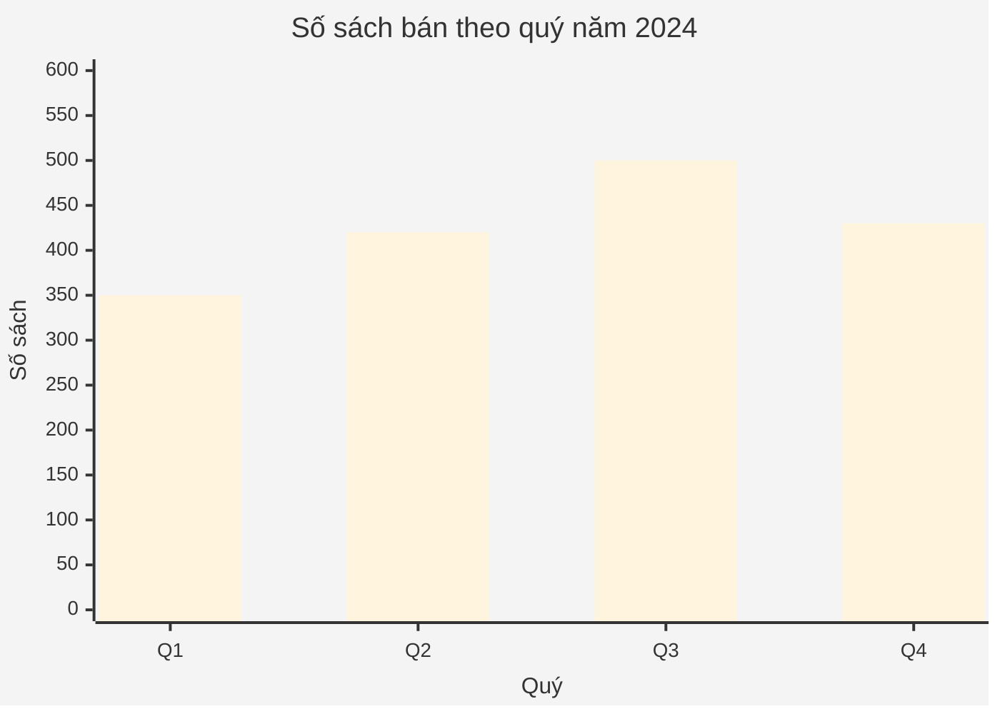
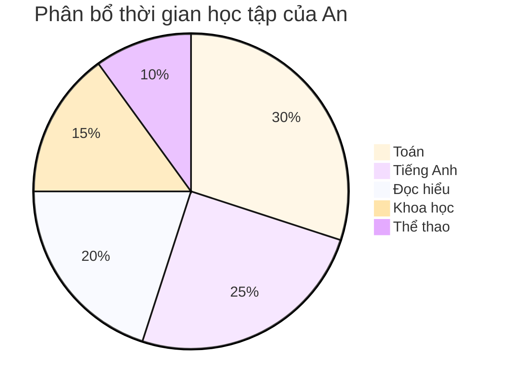

# Biểu đồ và bảng số liệu

Trong đề thi tuyển sinh lớp 6 THCS chuyên, học sinh thường gặp các bài toán yêu cầu **đọc, phân tích và diễn giải** dữ liệu từ biểu đồ hoặc bảng số liệu. Đây là kỹ năng quan trọng giúp học sinh vận dụng kiến thức toán học vào đời sống.

## 1. Các loại biểu đồ thường gặp

| Loại biểu đồ | Đặc điểm | Khi nào sử dụng |
|--------------|----------|-----------------|
| Biểu đồ cột *(Bar chart)* | Các cột song song, chiều cao thể hiện giá trị | So sánh nhiều đối tượng theo cùng một tiêu chí |
| Biểu đồ đường *(Line chart)* | Đường nối các điểm dữ liệu theo thứ tự | Theo dõi xu hướng, sự thay đổi theo thời gian |
| Biểu đồ hình tròn *(Pie chart)* | Hình tròn chia thành nhiều phần | Thể hiện tỷ lệ phần trăm của tổng thể |
| Biểu đồ cột chồng *(Stacked bar)* | Nhiều lớp trong cùng một cột | So sánh thành phần và tổng giá trị |

## 2. Quy trình phân tích biểu đồ

1. **Đọc tiêu đề** để hiểu chủ đề dữ liệu.
2. **Xác định trục / đơn vị**, chú thích màu sắc hoặc ký hiệu.
3. **Xác định giá trị lớn nhất, nhỏ nhất**, xu hướng tăng/giảm.
4. **Trả lời câu hỏi**: so sánh, tính tổng, chênh lệch, phần trăm.
5. **Kiểm tra hợp lý**: kết quả có phù hợp ngữ cảnh không?

## 3. Ví dụ minh họa

### Ví dụ 1 – Biểu đồ cột

> Biểu đồ dưới đây cho biết số sách bán được của một hiệu sách trong 4 quý năm 2024.  
> Q1: 350 quyển, Q2: 420 quyển, Q3: 500 quyển, Q4: 430 quyển.  
> 1. Quý nào bán được nhiều sách nhất?  
> 2. Tổng số sách bán ra cả năm?  
> 3. Tính tỉ lệ tăng trưởng từ Q1 tới Q3.

**Hướng dẫn giải**
1. Quý 3 (Q3) bán nhiều nhất.  
2. Tổng = 350 + 420 + 500 + 430 = **1 700** quyển.  
3. Tăng trưởng = \((500-350)/350\) × 100% ≈ **42,9 %**.

### Ví dụ 2 – Bảng số liệu

| Năm | Sản lượng lúa (triệu tấn) |
|-----|----------------------------|
| 2020 | 43 |
| 2021 | 44 |
| 2022 | 45,5 |
| 2023 | 46 |

> Tính trung bình sản lượng lúa 4 năm và phần trăm tăng so với năm 2020.

**Hướng dẫn giải**
- Trung bình = \((43 + 44 + 45,5 + 46)/4\) = **44,625** triệu tấn.  
- Tăng % = \((46 - 43)/43\) × 100% ≈ **6,98 %**.

### Minh hoạ 

## 4. Chiến lược làm bài

- **Tóm tắt dữ liệu**: ghi nhanh các con số quan trọng.
- **Gạch chân từ khóa** trong câu hỏi: "lớn nhất", "chênh lệch", "trung bình"…
- **Dùng phép tính hợp lý**: cộng, trừ, nhân, chia, tỉ lệ phần trăm.
- **Kiểm tra đơn vị** trước khi kết luận.

## 5. Bài tập luyện tập

### Bài tập 1

Biểu đồ hình tròn thể hiện thời gian học tập của An trong một tuần: Toán 30%, Tiếng Anh 25%, Đọc hiểu 20%, Khoa học 15%, Thể thao 10%.

1. Tổng thời gian học tập (không tính thể thao) chiếm bao nhiêu phần trăm?  
2. Nếu An học 14 giờ mỗi tuần cho Toán, tính tổng số giờ học trong tuần.

### Bài tập 2

Bảng dưới đây cho biết số học sinh tham gia 3 câu lạc bộ ở trường.

| Lớp | CLB Khoa học | CLB Nghệ thuật | CLB Thể thao |
|-----|--------------|----------------|--------------|
| 5A | 12 | 15 | 20 |
| 5B | 10 | 18 | 22 |
| 5C | 14 | 16 | 18 |

1. Lớp nào có số học sinh tham gia câu lạc bộ nhiều nhất?  
2. Tổng số học sinh tham gia CLB Thể thao?  
3. % học sinh CLB Nghệ thuật của lớp 5B so với tổng 3 câu lạc bộ lớp 5B?

---

Tiếp tục luyện tập giúp bạn thành thạo kỹ năng đọc và phân tích dữ liệu – yếu tố quan trọng cho phần **Trắc nghiệm tổng hợp** và **Toán ứng dụng** trong đề thi. 