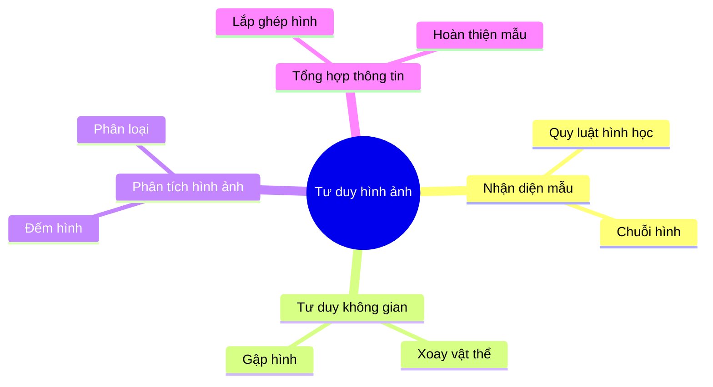
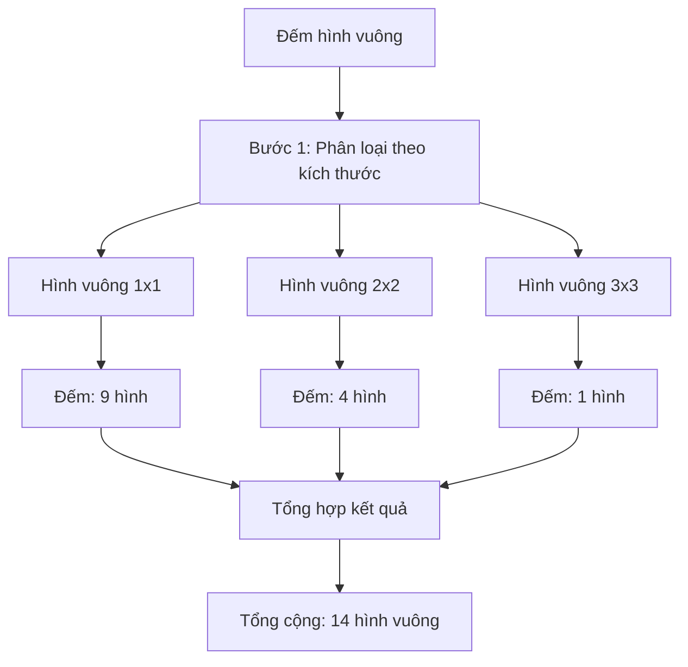
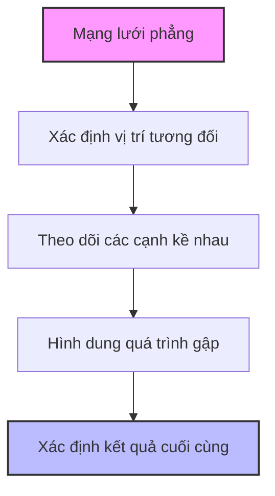
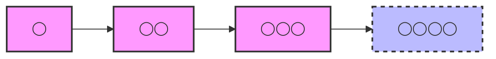
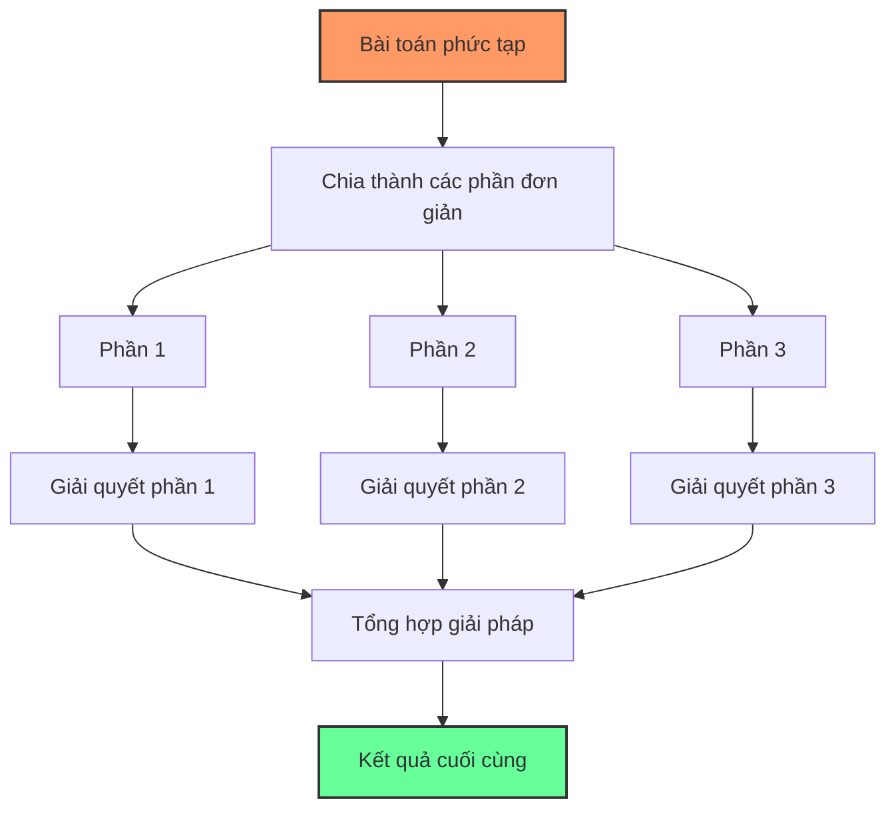
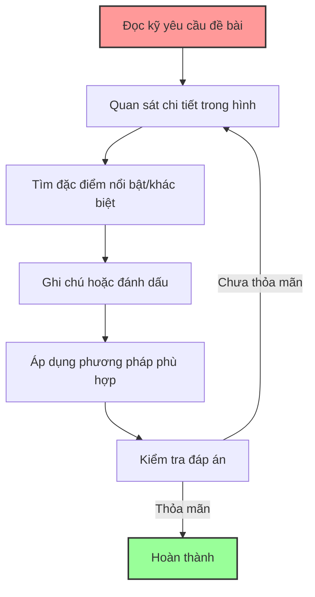

# Câu đố và tư duy hình ảnh

Phần thi về câu đố và tư duy hình ảnh đánh giá khả năng nhận diện quy luật hình học, nhận thức không gian và xử lý thông tin trực quan của học sinh - những kỹ năng rất quan trọng trong kỳ thi vào lớp 6 THCS chuyên.

## 1. Tầm quan trọng của tư duy hình ảnh

- **Rèn luyện trí tưởng tượng không gian** - một dạng thông minh đặc biệt
- **Phát triển khả năng nhận diện mẫu và quy luật** trực quan
- **Tăng cường khả năng phân tích và tổng hợp thông tin** hình ảnh
- **Bồi dưỡng trí tuệ đa chiều** vượt ra ngoài tư duy số học thuần túy

## 2. Các dạng bài toán tư duy hình ảnh thường gặp

### 2.1. Đếm hình

**Đặc điểm**:
- Yêu cầu đếm số lượng hình cụ thể (hình vuông, hình tam giác, đường thẳng...) trong một hình vẽ phức tạp
- Hình thường được thiết kế để có nhiều cách đếm và dễ bỏ sót

**Ví dụ**:  
Đếm tổng số hình vuông trong hình vẽ sau:

**Chiến lược giải**:
1. Phân loại các hình theo kích thước (1×1, 2×2, 3×3)
2. Đếm có hệ thống theo từng loại
3. Tổng hợp kết quả

> Đáp án: 14 hình vuông (9 hình vuông 1×1, 4 hình vuông 2×2, 1 hình vuông 3×3)

### 2.2. Xoay hình, gập hình

**Đặc điểm**:
- Yêu cầu dự đoán kết quả sau khi xoay, gập, lật một hình
- Thường đòi hỏi học sinh hình dung các vật thể trong không gian 

**Ví dụ**:  
Hình nào sẽ xuất hiện khi gập mạng lưới này thành hình lập phương?

**Chiến lược giải**:
1. Quan sát mối quan hệ giữa các mặt
2. Đánh dấu/ghi nhớ vị trí các điểm đặc biệt
3. Mô phỏng quá trình gập hình trong tư duy

### 2.3. Tìm hình khác biệt (Odd one out)

**Đặc điểm**:
- Cho một nhóm hình và yêu cầu tìm hình không phù hợp với quy luật chung
- Các tiêu chí để phân biệt có thể là: số lượng, hình dạng, màu sắc, hướng, đối xứng...

**Ví dụ**:  
Tìm hình khác biệt trong dãy sau:
🔺 🔺 🔻 🔺 🔺

**Chiến lược giải**:
1. Xác định các thuộc tính có thể so sánh
2. Tìm quy luật chiếm đa số
3. Xác định hình vi phạm quy luật đó

### 2.4. Tiếp tục dãy hình

**Đặc điểm**:
- Cho một dãy hình và yêu cầu xác định hình tiếp theo
- Quy luật có thể liên quan đến sự thay đổi về vị trí, hướng, hình dạng, số lượng...

**Ví dụ**:  
Tìm hình tiếp theo trong dãy:

**Chiến lược giải**:
1. Quan sát sự thay đổi giữa các hình liên tiếp
2. Tìm quy luật cho sự thay đổi đó
3. Áp dụng quy luật để xác định hình tiếp theo

### 2.5. Lắp ghép hình

**Đặc điểm**:
- Yêu cầu xác định bằng cách nào có thể lắp ghép các hình cho trước để tạo thành hình mục tiêu
- Đòi hỏi khả năng tưởng tượng không gian và khả năng biến đổi hình ảnh trong tâm trí

**Chiến lược giải**:
1. Quan sát kỹ hình mục tiêu
2. Phân tích các mảnh ghép, có thể cần xoay hoặc lật
3. Thử ghép từng mảnh vào vị trí phù hợp

## 3. Phương pháp giải quyết bài toán tư duy hình ảnh

### 3.1. Phương pháp chia để trị

1. **Phân tích hình thành các thành phần đơn giản hơn**
2. **Xử lý từng thành phần riêng biệt**
3. **Tổng hợp kết quả để có câu trả lời cuối cùng**

### 3.2. Phương pháp loại trừ

1. **Xác định các thuộc tính cần xem xét**
2. **Kiểm tra từng phương án có thể**
3. **Loại bỏ các phương án không phù hợp**
4. **Xác định phương án còn lại là đáp án**

### 3.3. Phương pháp tìm quy luật

1. **Quan sát kỹ xu hướng thay đổi trong dãy hình**
2. **Thử áp dụng các quy luật phổ biến**:
   - Xoay: 45°, 90°, 180°...
   - Đối xứng: trái-phải, trên-dưới
   - Tăng/giảm số lượng các phần tử
   - Kết hợp/phân tách các phần tử
3. **Kiểm chứng quy luật trên tất cả các hình đã cho**

### 3.4. Phát triển trực giác hình ảnh

- **Luyện tập đều đặn** với nhiều dạng bài khác nhau
- **Vẽ ra giấy** để kiểm chứng suy nghĩ
- **Sử dụng mô hình thực tế** (như mô hình giấy) nếu cần

## 4. Chiến lược làm bài thi

1. **Đọc kỹ yêu cầu đề bài**
2. **Quan sát cẩn thận tất cả chi tiết** trong hình
3. **Tìm kiếm các đặc điểm nổi bật hoặc khác biệt**
4. **Ghi chú hoặc đánh dấu** trực tiếp trên hình (nếu được phép)
5. **Kiểm tra đáp án với tất cả các điều kiện** của bài toán

## 5. Bài tập thực hành

### Bài tập 1: Đếm hình
Đếm số hình tam giác trong hình vẽ:

Đáp án và hướng dẫn

**Đáp án: 13 hình tam giác**

**Cách giải:**
1. Phân loại các tam giác theo kích thước và vị trí:
   - Tam giác nhỏ phía trên trái: 1 hình
   - Tam giác nhỏ phía trên phải: 1 hình
   - Tam giác nhỏ phía dưới trái: 1 hình
   - Tam giác nhỏ phía dưới phải: 1 hình
   - Tam giác nhỏ ở giữa phía dưới trái: 1 hình
   - Tam giác nhỏ ở giữa phía dưới phải: 1 hình
   - Tam giác vừa phía trái (gồm 2 tam giác nhỏ): 1 hình
   - Tam giác vừa phía phải (gồm 2 tam giác nhỏ): 1 hình
   - Tam giác vừa phía trên (phần trên của tam giác lớn): 1 hình
   - Tam giác vừa phía dưới trái: 1 hình
   - Tam giác vừa phía dưới phải: 1 hình
   - Tam giác lớn phía dưới (phần dưới tam giác lớn): 1 hình
   - Tam giác lớn cả hình: 1 hình

2. Kỹ thuật đếm:
   - Bắt đầu từ các tam giác nhỏ nhất, rõ ràng nhất
   - Tiếp tục với các tam giác được tạo bởi việc kết hợp các tam giác nhỏ
   - Kết thúc với các tam giác lớn nhất

3. Để tránh bỏ sót, đánh dấu các tam giác đã đếm bằng cách đánh số từ 1-13.

### Bài tập 2: Tìm quy luật
Tìm hình tiếp theo trong dãy:

Đáp án và hướng dẫn

**Đáp án: □■□■□**

**Cách giải:**
1. Quan sát quy luật trong dãy:
   - Hình 1: □ (một hình vuông trắng)
   - Hình 2: ■ (một hình vuông đen)
   - Hình 3: □■ (một hình vuông trắng và một hình vuông đen)
   - Hình 4: ■□■ (hình vuông đen, trắng, đen)

2. Phân tích quy luật:
   - Quy luật về số lượng hình vuông: 1, 1, 2, 3, ... → Số lượng tăng theo dãy Fibonacci (1,1,2,3,5,...)
   - Quy luật về màu sắc: Bắt đầu với trắng, sau đó đen, rồi xen kẽ trắng-đen

3. Dự đoán hình tiếp theo:
   - Số lượng hình vuông: 5 (tiếp theo trong dãy Fibonacci)
   - Màu sắc: Tiếp tục xen kẽ, bắt đầu với trắng (vì hình trước kết thúc với đen)
   
4. Vậy hình tiếp theo là: □■□■□ (chuỗi 5 hình vuông xen kẽ trắng-đen bắt đầu với trắng)

### Bài tập 3: Tìm hình khác biệt
Tìm hình khác với nhóm:

Đáp án và hướng dẫn

**Đáp án: D. ◮ (Hình mũi tên)**

**Cách giải:**
1. Phân tích đặc điểm của các hình:
   - Hình A: Tam giác đặc, hướng lên
   - Hình B: Tam giác rỗng, hướng lên
   - Hình C: Tam giác rỗng, hướng xuống
   - Hình D: Hình mũi tên rỗng (không phải tam giác)

2. Tìm đặc điểm chung của đa số:
   - Hình A, B, C đều là tam giác (có 3 cạnh, 3 góc)
   - Hình D không phải tam giác (có nhiều hơn 3 cạnh)

3. Phân tích phương pháp loại trừ:
   - Nếu xét về màu sắc: A khác (đặc), B và C giống nhau (rỗng)
   - Nếu xét về hướng: C khác (hướng xuống), A và B giống nhau (hướng lên)
   - Nếu xét về hình dạng cơ bản: D khác (không phải tam giác), A, B, C giống nhau (đều là tam giác)

4. Kết luận: Thuộc tính "hình dạng cơ bản" là thuộc tính quan trọng nhất, và theo đó, D là hình khác biệt vì không phải tam giác như các hình còn lại.

### Bài tập 4: Gập hình
Khi gập tờ giấy có hình vẽ ⬤ trên góc trái, sẽ được hình nào trong các hình sau?

Đáp án và hướng dẫn

**Đáp án: B. ⬤ ở góc phải dưới**

**Cách giải:**
1. Phân tích vị trí ban đầu:
   - Tờ giấy hình chữ nhật có kích thước dài hơn rộng
   - Điểm tròn đen nằm ở góc trên bên trái
   - Đường gập theo đường chéo từ góc trên bên trái đến góc dưới bên phải

2. Xác định quy luật gập:
   - Khi gập, nửa tờ giấy bên phải được gập lên trên, đè lên nửa bên trái
   - Góc trên bên trái (có điểm tròn) sẽ được gập đến vị trí góc dưới bên phải
   - Hình chữ nhật sau khi gập sẽ trở thành hình vuông

3. Áp dụng quy luật:
   - Điểm tròn đen ban đầu ở góc trên bên trái
   - Sau khi gập theo đường chéo, điểm tròn đen sẽ nằm ở góc phải dưới của hình vuông

4. Từ 4 lựa chọn A, B, C, D, chỉ có phương án B có điểm tròn ở góc phải dưới, phù hợp với kết quả sau khi gập.

### Bài tập 5: Lắp ghép hình
Ba mảnh ghép nào dưới đây có thể ghép lại thành hình vuông hoàn chỉnh?

Đáp án và hướng dẫn

**Đáp án: Mảnh 1 + 2 + 4 và Mảnh 3 + 4 + 5**

**Cách giải:**
1. Phân tích các mảnh ghép:
   - Mảnh 1: Tam giác vuông nhỏ (màu xanh nhạt)
   - Mảnh 2: Tam giác vuông lớn (màu xanh lá)
   - Mảnh 3: Hình chữ nhật (màu hồng)
   - Mảnh 4: Tam giác vuông ngược (màu vàng nhạt)
   - Mảnh 5: Hình thang (màu tím nhạt)

2. Phương pháp thử:
   - Cần 3 mảnh ghép tạo thành hình vuông
   - Hình vuông cần có 4 góc vuông và 4 cạnh bằng nhau

3. Kết quả thử nghiệm:
   - Mảnh 1 + 2 + 4: Tạo thành hình vuông hoàn chỉnh
     + Mảnh 2 (tam giác lớn) tạo nửa hình vuông
     + Mảnh 1 (tam giác nhỏ) lấp phần góc trên trái
     + Mảnh 4 (tam giác ngược) lấp phần góc dưới phải
   
   - Mảnh 3 + 4 + 5: Tạo thành hình vuông hoàn chỉnh
     + Mảnh 3 (hình chữ nhật) tạo phần trên của hình vuông
     + Mảnh 4 (tam giác ngược) lấp phần góc dưới bên trái
     + Mảnh 5 (hình thang) lấp phần còn lại ở góc dưới bên phải

   - Mảnh 1 + 3 + 4: Không tạo thành hình vuông hoàn chỉnh
     + Kích thước các mảnh không phù hợp để tạo thành hình vuông

4. Kiểm tra kích thước: Trong cả hai trường hợp tạo được hình vuông, các cạnh đều bằng nhau và tạo thành 4 góc vuông.

5. Kết luận: Có 2 cách ghép tạo thành hình vuông hoàn chỉnh: Mảnh 1 + 2 + 4 và Mảnh 3 + 4 + 5.

---

Rèn luyện tư duy hình ảnh không chỉ giúp học sinh vượt qua kỳ thi vào THCS chuyên mà còn phát triển trí tuệ không gian - một kỹ năng quan trọng trong nhiều lĩnh vực như toán học, khoa học, nghệ thuật và thiết kế sau này. 