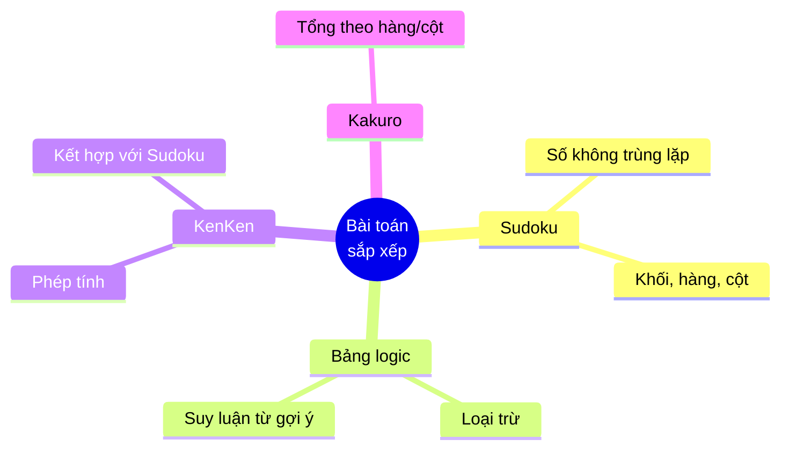
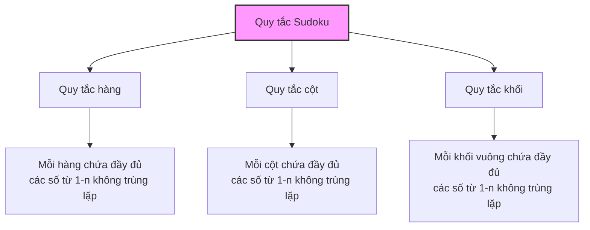
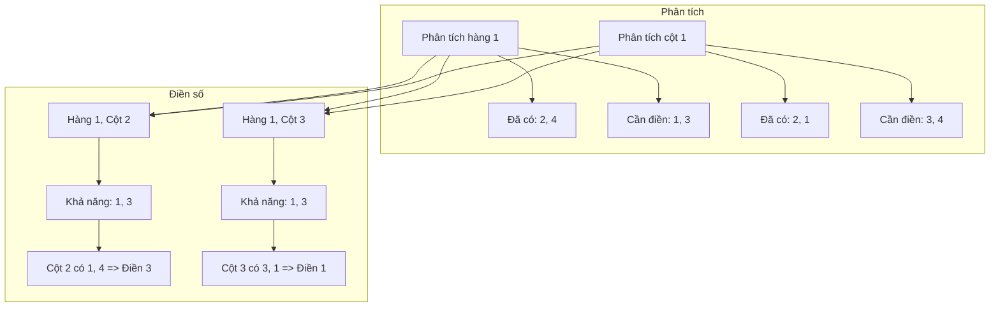
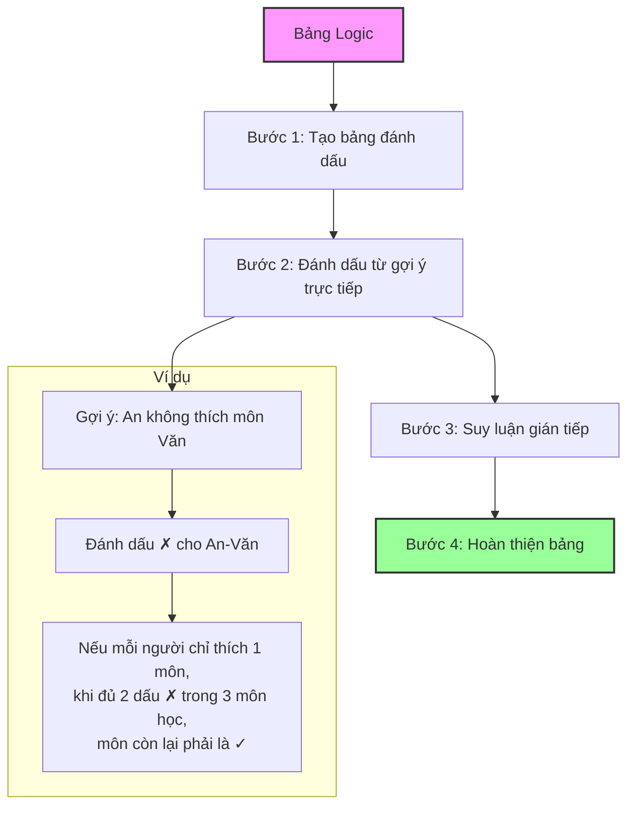
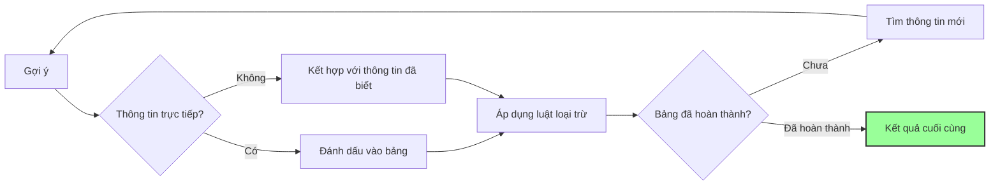
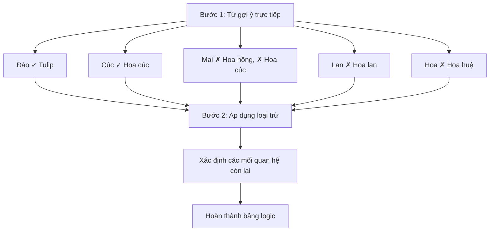
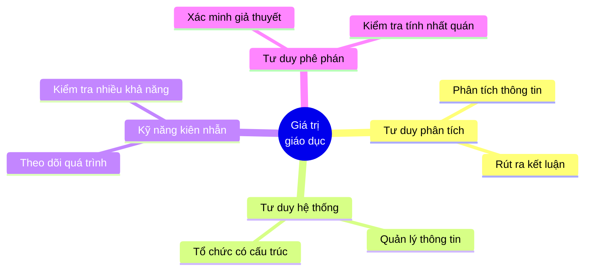

# Sudoku và bảng logic

Sudoku và bảng logic (logic grids) là những dạng bài tập rèn luyện tư duy suy luận, phân tích và loại trừ - những kỹ năng cốt lõi được đánh giá trong kỳ thi tuyển sinh lớp 6 THCS chuyên.

## 1. Sudoku - Bài toán sắp xếp số

### 1.1. Giới thiệu về Sudoku

Sudoku là trò chơi xếp số vào lưới 9×9 (hoặc phiên bản đơn giản 4×4, 6×6 cho học sinh tiểu học), được chia thành các ô vuông nhỏ hơn. Mục đích là điền các số từ 1-9 sao cho mỗi hàng ngang, cột dọc và mỗi ô vuông nhỏ đều chứa đầy đủ các số từ 1-9 mà không trùng lặp.

**Trong đề thi tuyển sinh**:
- Thường sử dụng phiên bản Sudoku 4×4 hoặc 6×6
- Có thể thay số bằng chữ cái, hình ảnh hoặc ký hiệu
- Đòi hỏi học sinh hiểu quy tắc và áp dụng logic để giải

### 1.2. Quy tắc cơ bản của Sudoku

- Mỗi hàng ngang phải chứa đầy đủ các số từ 1-n (với n là kích thước bảng) không trùng lặp
- Mỗi cột dọc phải chứa đầy đủ các số từ 1-n không trùng lặp
- Mỗi khối vuông nhỏ phải chứa đầy đủ các số từ 1-n không trùng lặp

### 1.3. Chiến lược giải Sudoku

#### 1.3.1. Quét hàng và cột

**Phương pháp**:
1. Xác định các số đã có trong mỗi hàng, cột, và khối
2. Xác định các ô chỉ có thể điền một giá trị duy nhất
3. Điền số vào và tiếp tục quá trình

**Ví dụ**: Sudoku 4×4 đơn giản

#### 1.3.2. Phương pháp Loại trừ

**Phương pháp**:
1. Xác định tất cả các số có thể điền vào mỗi ô
2. Nếu một số chỉ có thể xuất hiện ở một vị trí trong hàng/cột/khối, điền nó vào
3. Cập nhật các khả năng cho các ô khác và lặp lại quá trình

**Ví dụ**: Ô góc trên bên phải chỉ có thể là 2 vì 1, 3, 4 đã xuất hiện trong cùng hàng/cột

### 1.4. Mẹo giải Sudoku nhanh

- **Tập trung vào khu vực có nhiều số đã điền** để giới hạn các khả năng
- **Sử dụng bút chì đánh dấu** các số có thể điền vào mỗi ô
- **Tìm các "cặp ẩn"** - hai ô trong cùng đơn vị chỉ có thể chứa hai giá trị giống nhau
- **Kiểm tra kỹ trước khi điền số** để tránh mâu thuẫn

## 2. Bảng logic (Logic Grid Puzzles)

### 2.1. Giới thiệu về bảng logic

Bảng logic là loại câu đố yêu cầu người giải sử dụng các mệnh đề logic cho trước để thiết lập mối quan hệ giữa các đối tượng. Thông thường, một bảng logic sẽ bao gồm 3-4 đặc điểm khác nhau (như tên, màu sắc, sở thích, v.v.) và người giải phải xác định đối tượng nào sở hữu đặc điểm nào.

**Trong đề thi tuyển sinh**:
- Thường sử dụng bài toán đơn giản với 3 nhóm đặc điểm
- Đòi hỏi học sinh vận dụng logic để suy luận và loại trừ
- Rèn luyện tư duy hệ thống và khả năng tổ chức thông tin

### 2.2. Phương pháp giải bảng logic

#### 2.2.1. Sử dụng bảng đánh dấu

**Phương pháp**:
1. Vẽ bảng với các hàng và cột tương ứng với các nhóm đặc điểm
2. Sử dụng ký hiệu để đánh dấu:
   - ✓ (Đúng): Đối tượng sở hữu đặc điểm
   - ✗ (Sai): Đối tượng không sở hữu đặc điểm
3. Từ mỗi gợi ý, điền các ký hiệu thích hợp
4. Suy luận dần dần để hoàn thiện bảng

**Ví dụ**:  
Ba bạn An, Bình, Châu thích ba môn học khác nhau: Toán, Văn, Anh.
- An không thích môn Văn.
- Người thích môn Anh cũng thích màu đỏ.
- Bình thích màu vàng.
- Châu không thích môn Toán.

#### 2.2.2. Kỹ thuật loại trừ

**Phương pháp**:
1. Bắt đầu từ thông tin chắc chắn nhất
2. Sử dụng quy tắc "nếu A kết hợp với B, thì không thể kết hợp với C"
3. Khi một hàng/cột đã có đánh dấu ✓, các ô còn lại phải là ✗
4. Lặp lại quá trình cho đến khi giải xong bảng

### 2.3. Mẹo giải bảng logic hiệu quả

- **Bắt đầu từ thông tin trực tiếp**: Ưu tiên sử dụng các gợi ý chứa khẳng định trực tiếp
- **Sử dụng loại trừ**: Khi biết A không phải là X, có thể loại trừ khả năng này
- **Kiểm tra tính nhất quán**: Đảm bảo không có mâu thuẫn trong các kết luận
- **Tìm kiếm "chuỗi logic"**: Một kết luận có thể dẫn đến nhiều kết luận khác

## 3. Bài tập thực hành

### 3.1. Sudoku 4×4

### 3.2. Bài toán bảng logic

Năm bạn Mai, Hoa, Lan, Cúc và Đào mỗi người thích một loại hoa khác nhau: hồng, cúc, lan, huệ và tulip.
- Mai không thích hoa hồng và hoa cúc.
- Người thích hoa lan không phải là Lan.
- Cúc thích loài hoa trùng tên với mình.
- Đào thích hoa tulip.
- Hoa không thích hoa huệ.

Hãy xác định mỗi bạn thích loại hoa nào.

### 3.3. Biến thể Sudoku: Kenken

Điền số từ 1-4 vào bảng sao cho:
- Mỗi hàng và cột chứa đủ các số từ 1-4
- Các ô cùng khu vực (ký hiệu bằng chữ cái giống nhau) có tổng bằng:
  A: 5, B: 6, C: 3, D: 3, E: 5, F: 3, G: 2, H: 7

## 4. Giá trị giáo dục của Sudoku và bảng logic

### 4.1. Phát triển kỹ năng tư duy

- **Tư duy phân tích**: Phân tích thông tin đã biết để rút ra kết luận mới
- **Tư duy hệ thống**: Tổ chức và quản lý thông tin một cách có cấu trúc
- **Kiên nhẫn và cẩn trọng**: Theo dõi quá trình suy luận dài
- **Tư duy phê phán**: Kiểm tra và xác minh các giả thuyết

### 4.2. Ứng dụng trong học tập và cuộc sống

- **Nâng cao khả năng giải quyết vấn đề** trong nhiều tình huống
- **Rèn luyện tính kiên nhẫn và tập trung**
- **Cải thiện khả năng tổ chức thông tin** và quản lý dữ liệu
- **Phát triển tư duy logic** áp dụng cho môn Toán và các môn khoa học

---

Sudoku và bảng logic không chỉ là những bài tập hấp dẫn mà còn là công cụ tuyệt vời để phát triển tư duy logic và kỹ năng suy luận - những năng lực thiết yếu không chỉ cho kỳ thi vào lớp 6 mà còn cho sự thành công trong học tập và cuộc sống. 