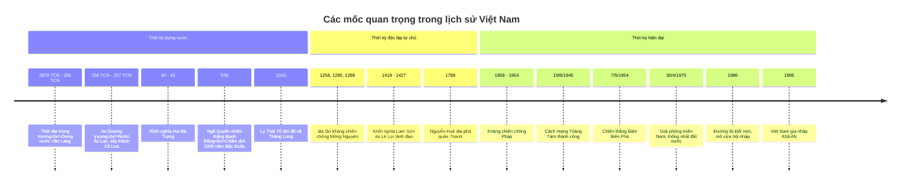
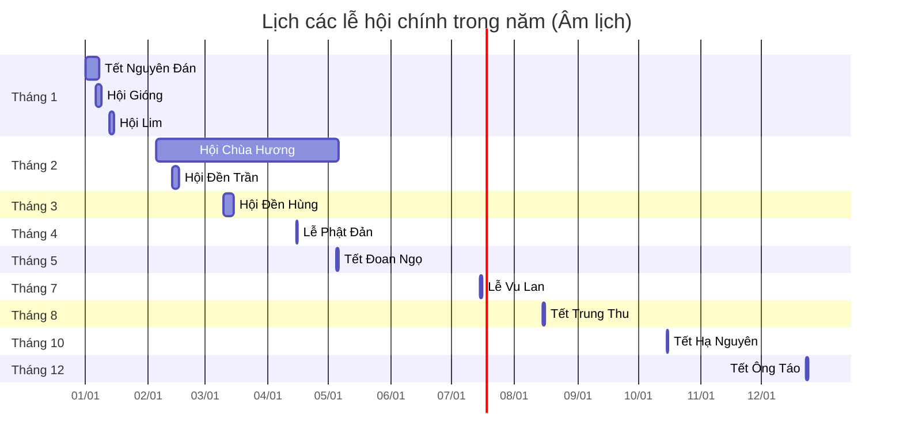

# Sự kiện và Lễ hội văn hóa

Việt Nam có lịch sử lâu đời với nhiều sự kiện lịch sử quan trọng và các lễ hội văn hóa đặc sắc. Phần này sẽ giúp học sinh nắm được những kiến thức cơ bản về các mốc lịch sử và lễ hội tiêu biểu.

## 1. Các mốc lịch sử quan trọng của Việt Nam

### 1.1. Thời kỳ dựng nước

| Thời kỳ/Sự kiện | Thời gian | Ý nghĩa lịch sử |
|-----------------|-----------|-----------------|
| **Thời đại Hùng Vương** | 2879 TCN - 258 TCN | Thời kỳ hình thành nhà nước đầu tiên của Việt Nam - Văn Lang |
| **Âu Lạc** | 258 TCN - 207 TCN | Nhà nước do An Dương Vương thành lập, nổi tiếng với thành Cổ Loa |
| **Cuộc khởi nghĩa Hai Bà Trưng** | 40 - 43 | Cuộc khởi nghĩa đầu tiên chống lại ách đô hộ phương Bắc |
| **Chiến thắng Bạch Đằng (Ngô Quyền)** | 938 | Chấm dứt 1000 năm Bắc thuộc, mở đầu thời kỳ độc lập |
| **Vạn Hạnh - Lý Công Uẩn** | 1010 | Dời đô từ Hoa Lư về Thăng Long (Hà Nội ngày nay) |

### 1.2. Thời kỳ chống ngoại xâm

| Thời kỳ/Sự kiện | Thời gian | Ý nghĩa lịch sử |
|-----------------|-----------|-----------------|
| **Kháng chiến chống Tống** | 981 | Chiến thắng của Lê Hoàn trên sông Bạch Đằng |
| **Ba lần kháng chiến chống Mông-Nguyên** | 1258, 1285, 1288 | Chặn đứng đội quân xâm lược mạnh nhất thế giới |
| **Chiến thắng Chi Lăng - Xương Giang** | 1427 | Lê Lợi đánh bại quân Minh, kết thúc 20 năm Bắc thuộc |
| **Quang Trung đại phá quân Thanh** | 1789 | Nguyễn Huệ đánh bại 29 vạn quân Thanh trong 5 ngày Tết |
| **Kháng chiến chống Pháp** | 1858 - 1954 | Kháng chiến chống thực dân Pháp, kết thúc với chiến thắng Điện Biên Phủ |

### 1.3. Thời kỳ hiện đại

| Thời kỳ/Sự kiện | Thời gian | Ý nghĩa lịch sử |
|-----------------|-----------|-----------------|
| **Cách mạng Tháng Tám** | 1945 | Lật đổ chế độ thực dân, phong kiến, giành độc lập |
| **Chiến thắng Điện Biên Phủ** | 1954 | Đánh bại thực dân Pháp, kết thúc chiến tranh Đông Dương lần thứ nhất |
| **Giải phóng miền Nam** | 1975 | Thống nhất đất nước sau 21 năm chia cắt |
| **Đổi Mới** | 1986 | Mở đầu công cuộc đổi mới toàn diện đất nước |
| **Việt Nam gia nhập ASEAN** | 1995 | Hội nhập quốc tế, mở đầu cho quá trình hội nhập sâu rộng |

### 1.4. Dòng thời gian lịch sử Việt Nam

## 2. Lễ hội truyền thống Việt Nam

### 2.1. Lễ hội theo mùa

| Lễ hội | Thời gian | Đặc điểm và ý nghĩa |
|--------|-----------|---------------------|
| **Tết Nguyên Đán** | Tháng 1-2 dương lịch | Lễ hội quan trọng nhất trong năm, đánh dấu năm mới âm lịch |
| **Lễ hội Lim** | Tháng 1-2 âm lịch | Nổi tiếng với hát quan họ (Bắc Ninh) |
| **Tết Đoan Ngọ** | Mùng 5/5 âm lịch | Ngày diệt trừ sâu bọ, tránh dịch bệnh |
| **Tết Trung Thu** | 15/8 âm lịch | Ngày hội cho trẻ em, có bánh trung thu, đèn lồng |
| **Lễ Vu Lan** | 15/7 âm lịch | Báo hiếu cha mẹ, tưởng nhớ tổ tiên |

### 2.2. Lịch các lễ hội chính trong năm theo tháng âm lịch

### 2.3. Lễ hội vùng miền

| Lễ hội | Địa điểm | Đặc điểm và ý nghĩa |
|--------|----------|---------------------|
| **Lễ hội Đền Hùng** | Phú Thọ | Tưởng nhớ công lao dựng nước của các Vua Hùng |
| **Hội Gióng** | Hà Nội | Tưởng nhớ Thánh Gióng, người anh hùng chống giặc ngoại xâm |
| **Lễ hội Chùa Hương** | Hà Nội | Kết hợp tín ngưỡng tôn giáo và cảnh đẹp thiên nhiên |
| **Lễ hội Đua ghe Ngo** | Sóc Trăng | Lễ hội truyền thống của đồng bào Khmer Nam Bộ |
| **Lễ hội Quật Động** | Thanh Hóa | Tái hiện phong trào Lam Sơn do Lê Lợi lãnh đạo |

## 3. Sự kiện và Lễ hội thế giới

### 3.1. Các sự kiện lịch sử thế giới

| Sự kiện | Thời gian | Ý nghĩa |
|---------|-----------|---------|
| **Cách mạng Pháp** | 1789 | Chấm dứt chế độ quân chủ chuyên chế ở Pháp |
| **Chiến tranh thế giới thứ nhất** | 1914 - 1918 | Cuộc chiến tranh lớn đầu tiên trên quy mô toàn cầu |
| **Chiến tranh thế giới thứ hai** | 1939 - 1945 | Cuộc chiến tranh lớn nhất trong lịch sử |
| **Thành lập Liên Hợp Quốc** | 1945 | Tổ chức quốc tế lớn nhất nhằm duy trì hòa bình thế giới |
| **Sự kiện 11/9** | 2001 | Vụ khủng bố tấn công Trung tâm Thương mại Thế giới ở New York |

### 3.2. Lễ hội văn hóa quốc tế

| Lễ hội | Quốc gia | Đặc điểm |
|--------|----------|----------|
| **Lễ hội Carnival Rio** | Brazil | Lễ hội với các vũ điệu Samba sôi động |
| **Lễ hội Tomatina** | Tây Ban Nha | Lễ hội ném cà chua nổi tiếng thế giới |
| **Lễ hội đèn lồng** | Trung Quốc | Kết thúc dịp Tết Nguyên Đán với đèn lồng đẹp mắt |
| **Lễ hội Songkran** | Thái Lan | Lễ hội té nước đón năm mới |
| **Lễ hội Oktoberfest** | Đức | Lễ hội bia lớn nhất thế giới |

## 4. Ý nghĩa giáo dục từ sự kiện và lễ hội

Nghiên cứu các sự kiện lịch sử và lễ hội văn hóa giúp chúng ta:

1. **Hiểu biết về lịch sử dân tộc** và giá trị văn hóa truyền thống
2. **Nuôi dưỡng lòng yêu nước**, tự hào dân tộc
3. **Gìn giữ và phát huy** các giá trị văn hóa truyền thống
4. **Hiểu biết về văn hóa thế giới**, tăng cường hội nhập quốc tế
5. **Rèn luyện kỹ năng nghiên cứu lịch sử** và phân tích sự kiện

## 5. Bài tập ứng dụng

### Bài tập 1: Xác định thời gian

Xếp các sự kiện sau theo đúng thứ tự thời gian:
1. Chiến thắng Điện Biên Phủ
2. Chiến thắng Bạch Đằng của Ngô Quyền
3. Khởi nghĩa Hai Bà Trưng
4. Nguyễn Huệ đại phá quân Thanh
5. Cách mạng Tháng Tám

Đáp án

3 - 2 - 4 - 1 - 5 (thứ tự từ xa xưa đến gần đây)

### Bài tập 2: Ghép cặp sự kiện và thời gian

Ghép mỗi sự kiện với thời gian tương ứng:

1. Cách mạng Tháng Tám a. 1954
2. Chiến thắng Điện Biên Phủ b. 1975
3. Ngày Giải phóng miền Nam c. 1945
4. Đổi Mới d. 1986
5. Việt Nam gia nhập ASEAN e. 1995

Đáp án

1-c, 2-a, 3-b, 4-d, 5-e

### Bài tập 3: Nhận diện lễ hội

Xác định địa phương diễn ra các lễ hội sau:
1. Lễ hội Đền Hùng
2. Lễ hội Chùa Hương
3. Hội Lim
4. Lễ hội Đua ghe Ngo
5. Lễ hội Quật Động

Đáp án

1. Phú Thọ
2. Hà Nội
3. Bắc Ninh
4. Sóc Trăng
5. Thanh Hóa

---

Hiểu biết về sự kiện lịch sử và lễ hội văn hóa là một phần quan trọng giúp học sinh nắm vững kiến thức xã hội, phát triển nhận thức về truyền thống dân tộc và giá trị văn hóa. Qua đó, các em sẽ trở thành những công dân có ý thức về bản sắc dân tộc, sẵn sàng gìn giữ và phát huy các giá trị văn hóa trong thời đại toàn cầu hóa. 