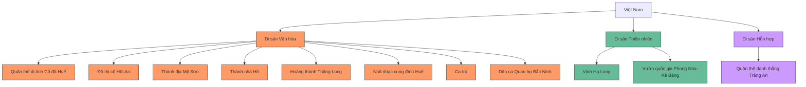
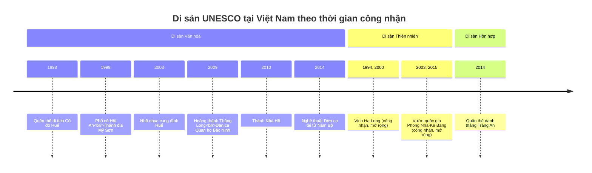

# Địa danh và Di tích lịch sử

Kiến thức về địa danh và di tích lịch sử là một phần quan trọng trong kỳ thi tuyển sinh lớp 6. Phần này giúp học sinh thể hiện hiểu biết về quê hương, đất nước và thế giới.

## 1. Địa danh và Di tích lịch sử Việt Nam

### 1.1. Miền Bắc

| Địa danh/Di tích | Vị trí | Đặc điểm nổi bật |
|------------------|--------|------------------|
| **Vịnh Hạ Long** | Quảng Ninh | Di sản thiên nhiên thế giới, có trên 1600 hòn đảo đá vôi |
| **Phố cổ Hà Nội** | Hà Nội | Khu phố cổ với các nghề truyền thống, 36 phố phường |
| **Khu di tích Tràng An** | Ninh Bình | Di sản hỗn hợp thế giới, phong cảnh sơn thủy hữu tình |
| **Đền Hùng** | Phú Thọ | Thờ các Vua Hùng - tổ tiên của dân tộc Việt Nam |
| **Thành Cổ Loa** | Hà Nội | Kinh đô thời An Dương Vương, có hình xoáy ốc với 3 vòng thành |

### 1.2. Miền Trung

| Địa danh/Di tích | Vị trí | Đặc điểm nổi bật |
|------------------|--------|------------------|
| **Cố đô Huế** | Thừa Thiên Huế | Kinh đô triều Nguyễn, di sản văn hóa thế giới |
| **Phố cổ Hội An** | Quảng Nam | Thương cảng cổ, di sản văn hóa thế giới |
| **Thánh địa Mỹ Sơn** | Quảng Nam | Quần thể đền tháp Chăm Pa, di sản văn hóa thế giới |
| **Khu di tích Nghĩa trang Trường Sơn** | Quảng Trị | Tưởng niệm các liệt sĩ hy sinh trong chiến tranh |
| **Phong Nha - Kẻ Bàng** | Quảng Bình | Vườn quốc gia, di sản thiên nhiên thế giới, có hang Sơn Đoòng |

### 1.3. Miền Nam

| Địa danh/Di tích | Vị trí | Đặc điểm nổi bật |
|------------------|--------|------------------|
| **Địa đạo Củ Chi** | TP. Hồ Chí Minh | Hệ thống đường hầm trong chiến tranh |
| **Quần đảo Côn Đảo** | Bà Rịa - Vũng Tàu | Nhà tù Côn Đảo, vườn quốc gia |
| **Đồng bằng sông Cửu Long** | Miền Tây Nam Bộ | Vùng sản xuất lúa gạo lớn nhất cả nước, có chợ nổi |
| **Tượng đài Mẹ Việt Nam anh hùng** | Quảng Nam | Tưởng niệm các bà mẹ có con hy sinh trong chiến tranh |
| **Dinh Độc Lập** | TP. Hồ Chí Minh | Công trình kiến trúc lịch sử, từng là nơi làm việc của Tổng thống Việt Nam Cộng hòa |

### 1.4. Phân bố di sản thế giới tại Việt Nam

### 1.5. Quá trình công nhận di sản thế giới tại Việt Nam

## 2. Địa danh và Di sản thế giới

### 2.1. Châu Á

| Địa danh/Di tích | Quốc gia | Đặc điểm nổi bật |
|------------------|----------|------------------|
| **Vạn Lý Trường Thành** | Trung Quốc | Công trình phòng thủ lớn nhất thế giới, dài trên 21.000 km |
| **Đền Angkor Wat** | Campuchia | Quần thể đền đài Hindu và Phật giáo lớn nhất thế giới |
| **Taj Mahal** | Ấn Độ | Lăng mộ bằng đá cẩm thạch, biểu tượng tình yêu |
| **Tháp Tokyo** | Nhật Bản | Biểu tượng của Tokyo, lấy cảm hứng từ tháp Eiffel |
| **Tử Cấm Thành** | Trung Quốc | Cung điện hoàng gia lớn nhất thế giới |

### 2.2. Châu Âu

| Địa danh/Di tích | Quốc gia | Đặc điểm nổi bật |
|------------------|----------|------------------|
| **Tháp Eiffel** | Pháp | Biểu tượng của Paris, cao 324m |
| **Đấu trường La Mã (Colosseum)** | Ý | Đấu trường cổ đại có thể chứa 50.000-80.000 người |
| **Tu viện Mont Saint-Michel** | Pháp | Tu viện trên đảo nhỏ, thủy triều bao quanh |
| **Cung điện Versailles** | Pháp | Cung điện hoàng gia, biểu tượng quyền lực tuyệt đối |
| **Bức tường Berlin** | Đức | Biểu tượng của Chiến tranh Lạnh, ngăn cách Đông-Tây Berlin |

### 2.3. Châu Mỹ và các châu lục khác

| Địa danh/Di tích | Quốc gia | Đặc điểm nổi bật |
|------------------|----------|------------------|
| **Tượng Nữ thần Tự do** | Hoa Kỳ | Biểu tượng tự do và dân chủ, cao 93m |
| **Machu Picchu** | Peru | Thành phố cổ của người Inca ở độ cao 2.430m |
| **Đại Kim tự tháp Giza** | Ai Cập | Kỳ quan cổ đại duy nhất còn tồn tại, cao 146,7m |
| **Opera House Sydney** | Australia | Công trình kiến trúc biểu tượng của Australia |
| **Đảo Phục Sinh** | Chile | Nổi tiếng với những bức tượng đá khổng lồ Moai |

## 3. Bảo tồn và phát huy giá trị di sản

Bảo vệ và phát huy giá trị di sản văn hóa, lịch sử là trách nhiệm của mỗi công dân. Một số biện pháp chính:

1. **Giáo dục và tuyên truyền** nâng cao nhận thức về giá trị di sản
2. **Bảo tồn, trùng tu** các công trình kiến trúc, di tích lịch sử
3. **Phát triển du lịch bền vững** gắn với bảo vệ di sản
4. **Nghiên cứu, sưu tầm** tài liệu, hiện vật liên quan đến di sản
5. **Tổ chức các sự kiện văn hóa** quảng bá giá trị di sản

## 4. Bài tập ứng dụng

### Bài tập 1: Nhận diện di tích

Xác định các di tích sau thuộc tỉnh/thành phố nào:
1. Văn Miếu - Quốc Tử Giám
2. Thành Nhà Hồ
3. Thánh địa Mỹ Sơn
4. Đền thờ Vua Hùng
5. Địa đạo Củ Chi

Đáp án

1. Hà Nội
2. Thanh Hóa
3. Quảng Nam
4. Phú Thọ
5. TP. Hồ Chí Minh

### Bài tập 2: Xác định Di sản Thế giới

Đánh dấu (✓) những di sản đã được UNESCO công nhận là Di sản Thế giới tại Việt Nam:

a. Vịnh Hạ Long  
b. Phố cổ Hà Nội  
c. Phong Nha - Kẻ Bàng  
d. Cố đô Huế  
e. Dinh Độc Lập  

Đáp án

a. Vịnh Hạ Long ✓  
b. Phố cổ Hà Nội ✗  
c. Phong Nha - Kẻ Bàng ✓  
d. Cố đô Huế ✓  
e. Dinh Độc Lập ✗  

### Bài tập 3: Ghép cặp

Ghép các địa danh với đặc điểm phù hợp:

1. Angkor Wat a. Ấn Độ
2. Taj Mahal b. Campuchia
3. Vạn Lý Trường Thành c. Ai Cập
4. Kim tự tháp Giza d. Trung Quốc
5. Machu Picchu e. Peru

Đáp án

1-b, 2-a, 3-d, 4-c, 5-e

---

Kiến thức về địa danh và di tích lịch sử không chỉ giúp học sinh đạt điểm cao trong kỳ thi mà còn giúp các em hiểu hơn về giá trị văn hóa, lịch sử của dân tộc và thế giới. Qua đó, các em sẽ có ý thức tốt hơn về việc bảo tồn và phát huy các giá trị này. 