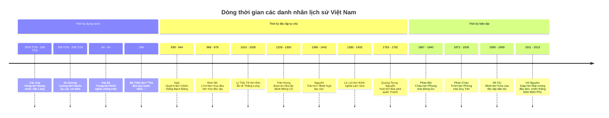
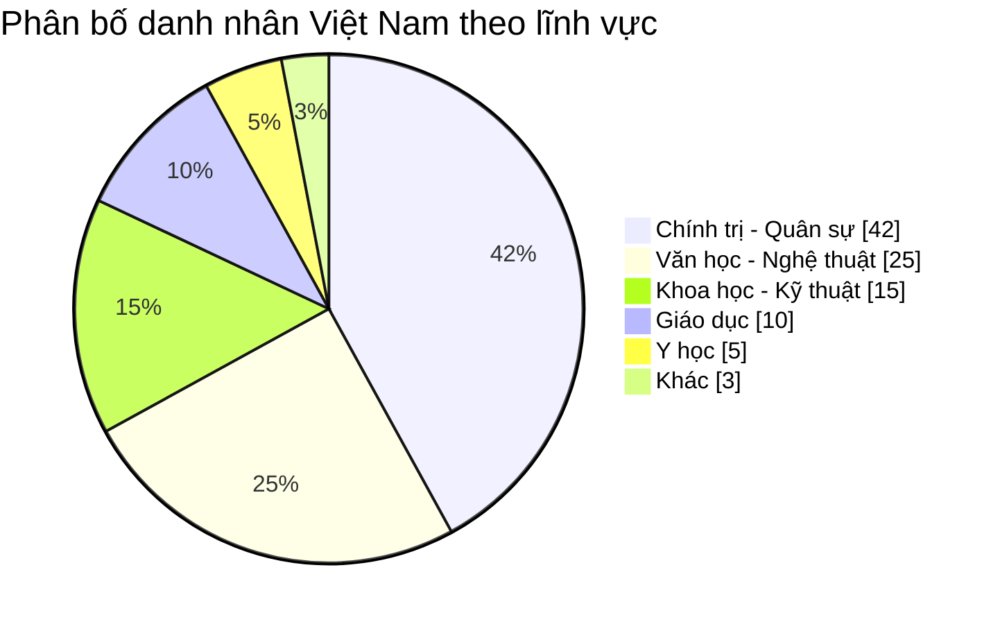

# Danh nhân Việt Nam

Lịch sử Việt Nam có nhiều danh nhân đã có những đóng góp to lớn cho sự nghiệp dựng nước và giữ nước. Phần này sẽ giới thiệu về các danh nhân tiêu biểu trong các lĩnh vực khác nhau.

## 1. Các vị vua và anh hùng dân tộc

### 1.1. Thời kỳ đầu

| Danh nhân | Thời kỳ | Đóng góp tiêu biểu |
|-----------|---------|---------------------|
| **Các Vua Hùng** | 2879 TCN - 258 TCN | Dựng nước Văn Lang, đặt nền móng cho quốc gia Việt Nam |
| **An Dương Vương** | 258 TCN - 208 TCN | Xây dựng thành Cổ Loa, chế tạo nỏ thần |
| **Hai Bà Trưng** | 40 - 43 | Lãnh đạo khởi nghĩa chống lại nhà Hán, lập nước Lĩnh Nam |
| **Bà Triệu** | 248 | Khởi nghĩa chống lại nhà Ngô với khẩu hiệu "thà làm quỷ nước Nam còn hơn làm vương đất Bắc" |
| **Lý Nam Đế** | 544 - 548 | Đánh đuổi quân Lương, lập nước Vạn Xuân |

### 1.2. Các triều đại độc lập

| Danh nhân | Thời kỳ | Đóng góp tiêu biểu |
|-----------|---------|---------------------|
| **Ngô Quyền** | 939 - 944 | Đánh thắng quân Nam Hán, chấm dứt 1000 năm Bắc thuộc |
| **Đinh Bộ Lĩnh** | 968 - 979 | Thống nhất đất nước, xưng Đinh Tiên Hoàng |
| **Lê Hoàn** | 980 - 1005 | Đánh bại quân Tống xâm lược |
| **Lý Thái Tổ** | 1010 - 1028 | Dời đô về Thăng Long, mở đầu nhà Lý |
| **Lý Thường Kiệt** | 1019 - 1105 | Chỉ huy đánh thắng quân Tống, tác giả câu "Nam quốc sơn hà" |
| **Trần Hưng Đạo** | 1228 - 1300 | Ba lần đánh bại quân Mông Cổ, viết "Hịch tướng sĩ" |
| **Lê Lợi** | 1385 - 1433 | Lãnh đạo khởi nghĩa Lam Sơn, đánh đuổi quân Minh |
| **Nguyễn Trãi** | 1380 - 1442 | Nhà chính trị, nhà văn hóa lớn, tác giả "Bình Ngô đại cáo" |
| **Quang Trung - Nguyễn Huệ** | 1753 - 1792 | Đánh bại quân Thanh, thống nhất đất nước |

### 1.3. Anh hùng thời hiện đại

| Danh nhân | Thời kỳ | Đóng góp tiêu biểu |
|-----------|---------|---------------------|
| **Phan Bội Châu** | 1867 - 1940 | Lãnh đạo phong trào Đông Du |
| **Phan Châu Trinh** | 1872 - 1926 | Lãnh đạo phong trào Duy Tân |
| **Hồ Chí Minh** | 1890 - 1969 | Lãnh tụ cách mạng, Chủ tịch nước đầu tiên của Việt Nam |
| **Võ Nguyên Giáp** | 1911 - 2013 | Đại tướng đầu tiên, chỉ huy chiến thắng Điện Biên Phủ |
| **Tôn Đức Thắng** | 1888 - 1980 | Người đứng đầu phong trào công nhân, Chủ tịch nước thứ hai |

### 1.4. Dòng thời gian danh nhân lịch sử Việt Nam

## 2. Danh nhân văn hóa, khoa học, giáo dục

### 2.1. Các nhà văn hóa, tư tưởng

| Danh nhân | Thời kỳ | Đóng góp tiêu biểu |
|-----------|---------|---------------------|
| **Chu Văn An** | 1292 - 1370 | Nhà giáo nổi tiếng thời Trần, biểu tượng của người thầy mẫu mực |
| **Nguyễn Bỉnh Khiêm** | 1491 - 1585 | Nhà thơ, nhà giáo, tiên tri, hiệu là Trạng Trình |
| **Lê Quý Đôn** | 1726 - 1784 | Nhà bác học, tác giả nhiều công trình nghiên cứu lớn |
| **Nguyễn Đình Chiểu** | 1822 - 1888 | Nhà thơ yêu nước, tác giả truyện Lục Vân Tiên |
| **Tản Đà** | 1889 - 1939 | Nhà thơ, nhà văn tiêu biểu đầu thế kỷ 20 |

### 2.2. Các nhà khoa học, kỹ thuật

| Danh nhân | Thời kỳ | Đóng góp tiêu biểu |
|-----------|---------|---------------------|
| **Lương Thế Vinh** | 1441 - 1496 | Nhà toán học, tác giả sách "Đại thành toán pháp" |
| **Hồ Nguyên Trừng** | 1374 - 1446 | Nhà kỹ thuật, sáng chế nhiều loại vũ khí |
| **Phạm Hồng Thái** | 1896 - 1924 | Nhà cách mạng, ám sát Toàn quyền Đông Dương Merlin |
| **Tạ Quang Bửu** | 1910 - 1986 | Nhà toán học, Bộ trưởng Bộ Quốc phòng, Bộ trưởng Bộ Đại học và Trung học chuyên nghiệp |
| **Tôn Thất Tùng** | 1912 - 1982 | Bác sĩ phẫu thuật, người đi tiên phong trong phẫu thuật gan trên thế giới |

### 2.3. Các nhà văn, nhà thơ nổi tiếng

| Danh nhân | Thời kỳ | Đóng góp tiêu biểu |
|-----------|---------|---------------------|
| **Nguyễn Du** | 1766 - 1820 | Đại thi hào, tác giả truyện Kiều |
| **Hồ Xuân Hương** | 1772 - 1822 | Nữ sĩ nổi tiếng với thơ nôm mang tính dân gian, phê phán xã hội |
| **Nguyễn Trãi** | 1380 - 1442 | Nhà văn hóa lớn, tác giả "Quốc âm thi tập", "Ức Trai thi tập" |
| **Nguyễn Khuyến** | 1835 - 1909 | Nhà thơ nổi tiếng thời nhà Nguyễn |
| **Nam Cao** | 1917 - 1951 | Nhà văn hiện thực xuất sắc, tác giả "Chí Phèo", "Lão Hạc" |

### 2.4. Phân bố danh nhân theo lĩnh vực

## 3. Di sản của các danh nhân

### 3.1. Di sản vật thể

| Di sản | Danh nhân liên quan | Địa điểm |
|--------|---------------------|----------|
| **Khu di tích Đền Hùng** | Các Vua Hùng | Phú Thọ |
| **Văn Miếu - Quốc Tử Giám** | Chu Văn An và các nhà giáo | Hà Nội |
| **Lăng Chủ tịch Hồ Chí Minh** | Hồ Chí Minh | Hà Nội |
| **Nhà lưu niệm Nguyễn Du** | Nguyễn Du | Hà Tĩnh |
| **Đền thờ Hai Bà Trưng** | Hai Bà Trưng | Hà Nội |

### 3.2. Di sản phi vật thể

| Di sản | Danh nhân liên quan | Ý nghĩa |
|--------|---------------------|---------|
| **Truyện Kiều** | Nguyễn Du | Kiệt tác văn học Việt Nam |
| **Bình Ngô đại cáo** | Nguyễn Trãi | Tuyên ngôn độc lập đầu tiên của Việt Nam |
| **Tư tưởng Hồ Chí Minh** | Hồ Chí Minh | Tư tưởng xuyên suốt về độc lập, tự do, hạnh phúc |
| **Chiến thuật Trần Hưng Đạo** | Trần Hưng Đạo | Chiến thuật quân sự độc đáo của Việt Nam |
| **Âm nhạc Văn Cao** | Văn Cao | Tác giả Quốc ca và nhiều bài hát nổi tiếng |

## 4. Giá trị giáo dục từ các danh nhân

Nghiên cứu về các danh nhân giúp chúng ta:

1. **Hiểu sâu sắc về lịch sử dân tộc** qua từng giai đoạn
2. **Học hỏi tinh thần yêu nước** và các phẩm chất cao đẹp
3. **Trân trọng di sản văn hóa** của dân tộc
4. **Noi gương các bậc tiền nhân** trong học tập và rèn luyện
5. **Phát triển ý thức trách nhiệm** với quê hương, đất nước

## 5. Bài tập ứng dụng

### Bài tập 1: Xác định nhân vật lịch sử

Ai là người đã:
1. Đánh bại quân xâm lược Tống trên sông Bạch Đằng năm 938?
2. Viết "Bình Ngô đại cáo" sau khi đánh đuổi quân Minh?
3. Lãnh đạo khởi nghĩa chống nhà Hán năm 40?
4. Đánh bại 29 vạn quân Thanh trong 5 ngày Tết Kỷ Dậu 1789?
5. Lãnh đạo cuộc khởi nghĩa Lam Sơn (1418-1427)?

Đáp án

1. Ngô Quyền
2. Nguyễn Trãi
3. Hai Bà Trưng
4. Nguyễn Huệ (Quang Trung)
5. Lê Lợi

### Bài tập 2: Ghép cặp danh nhân và tác phẩm

Ghép mỗi danh nhân với tác phẩm của họ:

1. Nguyễn Du a. "Chiếu dời đô"
2. Lý Công Uẩn b. "Truyện Kiều"
3. Nguyễn Trãi c. "Bình Ngô đại cáo"
4. Hồ Xuân Hương d. "Lục Vân Tiên"
5. Nguyễn Đình Chiểu e. "Bánh trôi nước"

Đáp án

1-b, 2-a, 3-c, 4-e, 5-d

### Bài tập 3: Xác định thời kỳ sống

Xếp các danh nhân sau theo thứ tự thời gian sống (từ xưa đến nay):
1. Hồ Chí Minh
2. Nguyễn Du
3. Trần Hưng Đạo
4. Lê Lợi
5. Phan Bội Châu

Đáp án

3 - 4 - 2 - 5 - 1

---

Tìm hiểu về các danh nhân Việt Nam không chỉ giúp học sinh nắm vững kiến thức lịch sử mà còn truyền cảm hứng về lòng yêu nước và các phẩm chất cao đẹp. Học tập và noi gương các danh nhân giúp các em trở thành những công dân có ích cho xã hội, tiếp nối truyền thống tốt đẹp của dân tộc. 