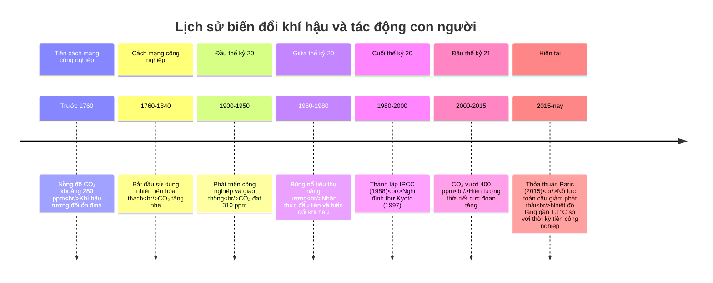
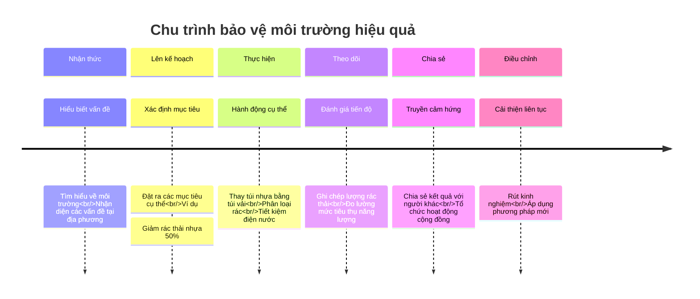

# Môi trường và Bảo vệ Thiên nhiên

Môi trường là tất cả những gì xung quanh chúng ta, bao gồm không khí, nước, đất, sinh vật và các yếu tố tự nhiên khác. Việc hiểu biết về môi trường và các vấn đề liên quan đến bảo vệ môi trường là điều cần thiết cho mỗi học sinh.

## 1. Khái niệm cơ bản về môi trường

### 1.1. Các thành phần của môi trường

| Thành phần | Mô tả | Ví dụ |
|------------|-------|-------|
| **Môi trường tự nhiên** | Môi trường hình thành tự nhiên, không có sự can thiệp của con người | Rừng nguyên sinh, đại dương, không khí |
| **Môi trường nhân tạo** | Môi trường do con người tạo ra | Thành phố, cầu đường, công viên |
| **Môi trường vật lý** | Bao gồm các yếu tố vô sinh | Đất, nước, không khí, ánh sáng |
| **Môi trường sinh học** | Bao gồm các sinh vật sống | Động vật, thực vật, vi sinh vật |
| **Môi trường xã hội** | Các mối quan hệ giữa con người với nhau | Gia đình, trường học, cộng đồng |

### 1.2. Tài nguyên thiên nhiên

| Loại tài nguyên | Đặc điểm | Ví dụ |
|-----------------|----------|-------|
| **Tài nguyên tái tạo** | Có thể tự tái tạo trong thời gian ngắn | Gió, ánh sáng mặt trời, nước |
| **Tài nguyên không tái tạo** | Không thể tái tạo hoặc tái tạo rất chậm | Than đá, dầu mỏ, khoáng sản |
| **Tài nguyên vô tận** | Không bao giờ cạn kiệt | Năng lượng mặt trời, gió |
| **Tài nguyên sinh vật** | Các loài sinh vật | Rừng, động vật hoang dã |
| **Tài nguyên đất** | Lớp đất màu mỡ | Đất nông nghiệp, đất rừng |

## 2. Các vấn đề môi trường hiện nay

### 2.1. Ô nhiễm môi trường

| Loại ô nhiễm | Nguyên nhân | Hậu quả |
|--------------|------------|----------|
| **Ô nhiễm không khí** | Khói thải từ xe cộ, nhà máy, đốt rác | Bệnh đường hô hấp, mưa axit, hiệu ứng nhà kính |
| **Ô nhiễm nước** | Xả thải công nghiệp, rác thải sinh hoạt, hóa chất nông nghiệp | Thiếu nước sạch, cá chết, bệnh tật |
| **Ô nhiễm đất** | Rác thải, hóa chất, thuốc trừ sâu | Đất xấu, mất dinh dưỡng, ảnh hưởng đến cây trồng |
| **Ô nhiễm tiếng ồn** | Xe cộ, xây dựng, hoạt động công nghiệp | Stress, mất ngủ, giảm sức khỏe |
| **Ô nhiễm ánh sáng** | Đèn điện quá mức, biển quảng cáo | Ảnh hưởng đến sinh vật, mất ngủ |

### 2.2. Biến đổi khí hậu

| Khía cạnh | Mô tả | Hậu quả |
|-----------|-------|---------|
| **Hiệu ứng nhà kính** | Khí thải giữ nhiệt trong khí quyển | Nhiệt độ toàn cầu tăng |
| **Nóng lên toàn cầu** | Nhiệt độ trung bình Trái Đất tăng | Băng tan, nước biển dâng |
| **Sự tan chảy băng** | Băng ở Bắc Cực, Nam Cực tan | Mực nước biển dâng cao |
| **Thời tiết cực đoan** | Thay đổi mô hình thời tiết | Bão, lũ lụt, hạn hán tăng |
| **Axit hóa đại dương** | Đại dương hấp thụ CO₂ | San hô chết, sinh vật biển bị ảnh hưởng |

#### Biến đổi khí hậu qua các thời kỳ

### 2.3. Mất đa dạng sinh học

| Vấn đề | Nguyên nhân | Hậu quả |
|--------|-------------|----------|
| **Phá rừng** | Mở rộng đất nông nghiệp, khai thác gỗ | Mất nơi ở của động vật, xói mòn đất |
| **Săn bắn quá mức** | Buôn bán động vật hoang dã, thực phẩm | Nhiều loài có nguy cơ tuyệt chủng |
| **Ô nhiễm sinh thái** | Hóa chất, nhựa, dầu tràn | Sinh vật chết, mất cân bằng sinh thái |
| **Loài ngoại lai xâm hại** | Du nhập sinh vật từ nơi khác | Cạnh tranh với loài bản địa |
| **Biến đổi môi trường sống** | Xây dựng, khai thác | Sinh vật mất nơi sinh sống |

## 3. Bảo vệ môi trường và phát triển bền vững

### 3.1. Các giải pháp bảo vệ môi trường

| Giải pháp | Thực hiện | Lợi ích |
|-----------|-----------|---------|
| **Tiết kiệm năng lượng** | Tắt đèn, thiết bị khi không dùng | Giảm khí thải, tiết kiệm tài nguyên |
| **Giảm thiểu, tái sử dụng, tái chế** | Phân loại rác, dùng túi vải | Giảm rác thải, tiết kiệm tài nguyên |
| **Bảo vệ rừng** | Trồng cây, không phá rừng | Giữ đa dạng sinh học, chống xói mòn |
| **Sử dụng năng lượng sạch** | Năng lượng mặt trời, gió | Giảm ô nhiễm, bảo vệ tài nguyên |
| **Tiết kiệm nước** | Sửa vòi nước rò rỉ, tận dụng nước mưa | Bảo vệ nguồn nước, giảm lãng phí |

#### Chu trình hành động bảo vệ môi trường

### 3.2. Phát triển bền vững

| Khía cạnh | Mô tả | Ví dụ |
|-----------|-------|-------|
| **Bền vững về môi trường** | Sử dụng tài nguyên không vượt quá khả năng tái tạo | Đánh bắt cá trong giới hạn phục hồi |
| **Bền vững về kinh tế** | Phát triển kinh tế không làm cạn kiệt tài nguyên | Du lịch sinh thái |
| **Bền vững về xã hội** | Đảm bảo công bằng, an sinh xã hội | Tiếp cận giáo dục, y tế cho mọi người |
| **Năng lượng bền vững** | Sử dụng năng lượng tái tạo | Điện mặt trời, điện gió |
| **Nông nghiệp bền vững** | Canh tác không làm suy kiệt đất | Nông nghiệp hữu cơ, luân canh |

### 3.3. Trách nhiệm bảo vệ môi trường

| Đối tượng | Trách nhiệm | Hành động cụ thể |
|-----------|-------------|------------------|
| **Cá nhân** | Thay đổi thói quen hàng ngày | Tiết kiệm điện, nước, phân loại rác |
| **Gia đình** | Giáo dục ý thức môi trường | Dạy trẻ bảo vệ môi trường từ nhỏ |
| **Trường học** | Giáo dục môi trường | Tổ chức hoạt động trồng cây, dọn rác |
| **Doanh nghiệp** | Sản xuất sạch, có trách nhiệm | Xử lý chất thải, tiết kiệm năng lượng |
| **Chính phủ** | Ban hành và thực thi luật | Quy định về môi trường, xử phạt vi phạm |

## 4. Bài tập ứng dụng

### Bài tập 1: Phân loại rác thải

Phân loại các loại rác thải sau vào đúng nhóm (rác hữu cơ, rác tái chế, rác nguy hại):
1. Vỏ trái cây
2. Pin đã qua sử dụng
3. Chai nhựa
4. Thức ăn thừa
5. Giấy báo cũ

Đáp án

1. Vỏ trái cây: Rác hữu cơ
2. Pin đã qua sử dụng: Rác nguy hại
3. Chai nhựa: Rác tái chế
4. Thức ăn thừa: Rác hữu cơ
5. Giấy báo cũ: Rác tái chế

### Bài tập 2: Hiểu về biến đổi khí hậu

Xác định đúng/sai cho các phát biểu sau:
1. Hiệu ứng nhà kính là nguyên nhân gây ra biến đổi khí hậu
2. Nóng lên toàn cầu chỉ ảnh hưởng đến vùng nhiệt đới
3. Khí CO₂ là một trong những khí nhà kính chính
4. Biến đổi khí hậu không liên quan đến hoạt động của con người
5. Việc trồng nhiều cây xanh có thể giúp giảm biến đổi khí hậu

Đáp án

1. Đúng
2. Sai (ảnh hưởng toàn cầu)
3. Đúng
4. Sai (hoạt động của con người là nguyên nhân chính)
5. Đúng

### Bài tập 3: Đề xuất giải pháp

Đề xuất 2 giải pháp cụ thể để giải quyết các vấn đề môi trường sau:
1. Ô nhiễm nhựa đại dương
2. Phá rừng
3. Tiêu thụ năng lượng quá mức
4. Thiếu nước sạch
5. Tuyệt chủng động vật hoang dã

Gợi ý đáp án

1. Ô nhiễm nhựa đại dương:
   - Giảm sử dụng đồ nhựa dùng một lần
   - Tổ chức dọn rác bãi biển, tái chế nhựa

2. Phá rừng:
   - Trồng cây, phủ xanh đồi trọc
   - Giảm tiêu thụ giấy, sử dụng gỗ có chứng nhận bền vững

3. Tiêu thụ năng lượng quá mức:
   - Sử dụng thiết bị tiết kiệm năng lượng
   - Phát triển nguồn năng lượng tái tạo

4. Thiếu nước sạch:
   - Thu gom nước mưa để sử dụng
   - Xây dựng hệ thống lọc nước cộng đồng

5. Tuyệt chủng động vật hoang dã:
   - Thiết lập các khu bảo tồn
   - Tuyên truyền, giáo dục về bảo vệ động vật hoang dã

---

Bảo vệ môi trường là trách nhiệm của mỗi người. Thông qua việc học tập và thực hành các kiến thức về môi trường, học sinh sẽ góp phần xây dựng một tương lai xanh, sạch và bền vững cho thế hệ mai sau. 