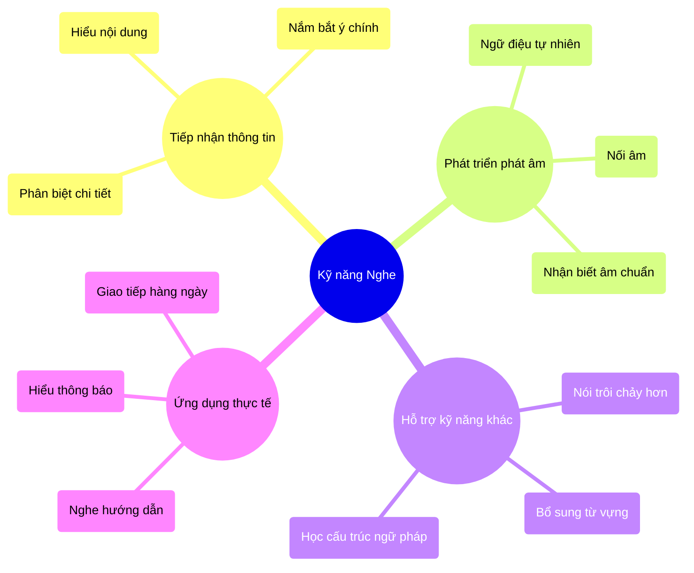
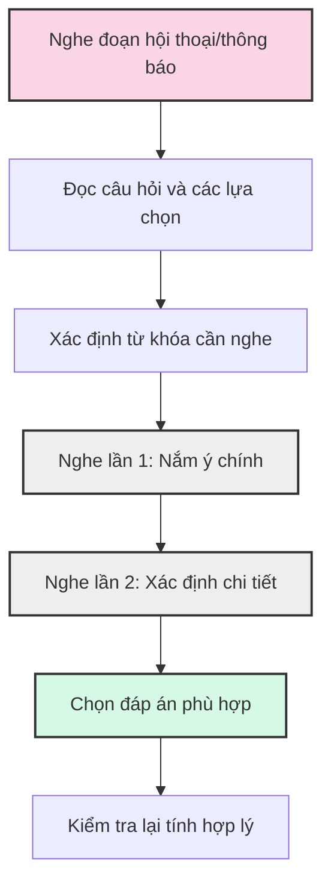
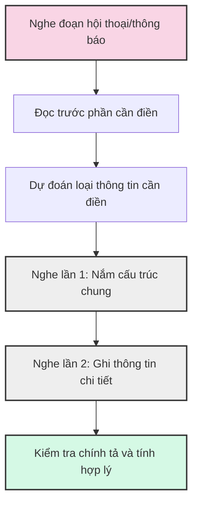
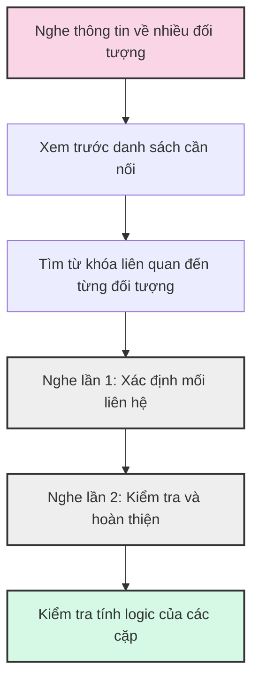
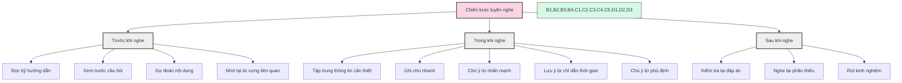
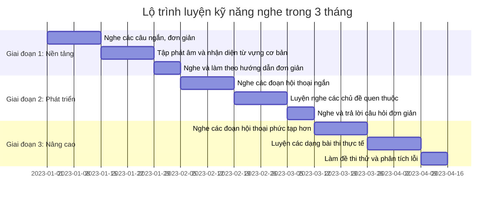
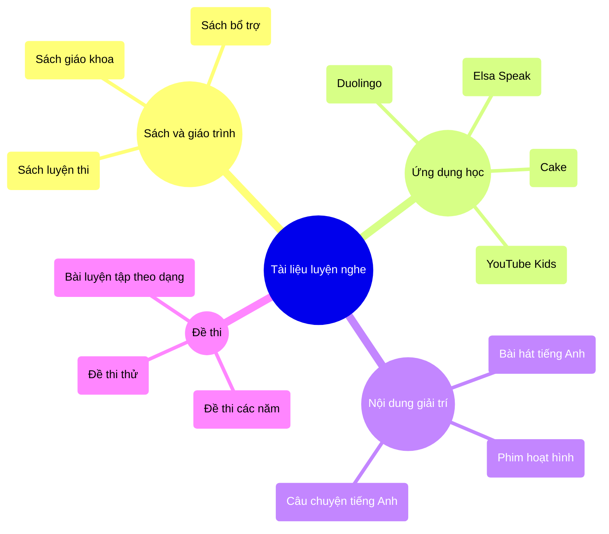
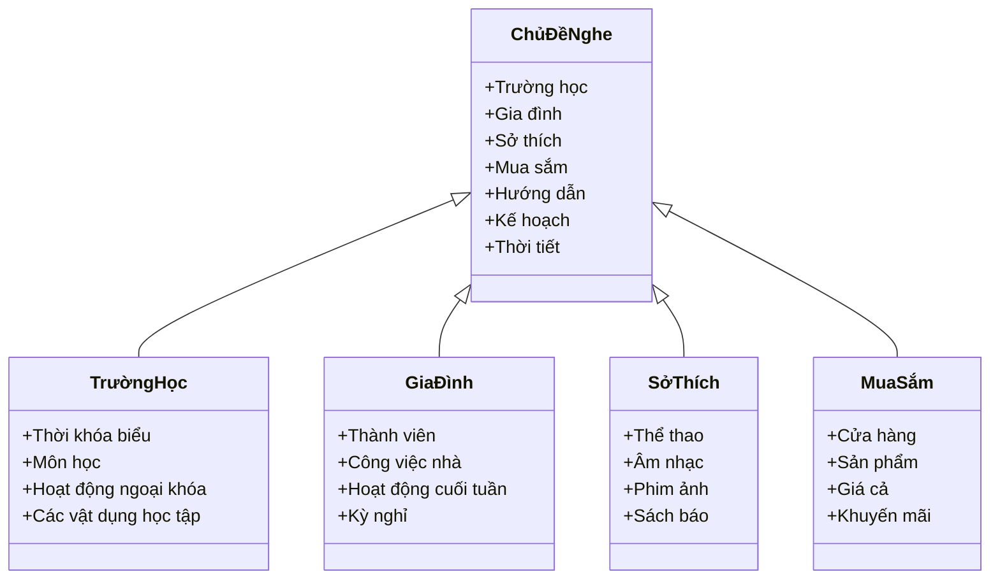
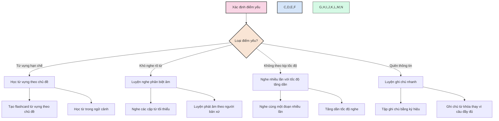

# Kỹ năng Nghe (Listening)

Kỹ năng nghe là một trong những kỹ năng cơ bản và quan trọng trong việc học tiếng Anh. Phần thi nghe trong kỳ thi tuyển sinh lớp 6 nhằm đánh giá khả năng tiếp nhận thông tin bằng tiếng Anh của học sinh.

## 1. Vai trò của kỹ năng nghe



## 2. Các dạng bài nghe thường gặp

### 2.1. Nghe và chọn đáp án đúng



**Ví dụ**:
```
Listen to the conversation. Then choose the correct answer.
1. What time does the museum open?
   a) 8:00 AM    b) 9:00 AM    c) 10:00 AM

2. How much is the ticket for children?
   a) $5         b) $8         c) Free
```

**Lưu ý**:
- Đọc kỹ câu hỏi và các lựa chọn trước khi nghe
- Tìm từ khóa trong câu hỏi để tập trung nghe
- Chú ý đến thông tin cụ thể như số, thời gian, địa điểm
- Cẩn thận với các thông tin gây nhiễu

### 2.2. Nghe và điền thông tin



**Ví dụ**:
```
Listen and complete the form.

SCHOOL TRIP REGISTRATION

Destination: _____________ (1)
Date: _____________ (2)
Meeting point: _____________ (3)
Items to bring: _____________ (4) and _____________ (5)
```

**Lưu ý**:
- Chú ý đến giới hạn số từ cần điền
- Ghi chính xác chính tả, viết hoa khi cần thiết
- Chỉ viết những từ bạn nghe được, không thêm từ
- Nghe kỹ các thông tin chi tiết như số điện thoại, địa chỉ

### 2.3. Nghe và nối thông tin



**Ví dụ**:
```
Listen and match the people with their hobbies.

People:          Hobbies:
1. Tom           a. swimming
2. Mary          b. playing guitar
3. David         c. reading books
4. Sarah         d. painting
```

**Lưu ý**:
- Đọc kỹ danh sách trước khi nghe
- Chú ý các từ đồng nghĩa hoặc diễn đạt khác
- Kiểm tra xem mỗi mục chỉ nối với một đáp án hay có thể nhiều đáp án
- Cẩn thận với thông tin gây nhiễu

## 3. Chiến lược luyện nghe hiệu quả



## 4. Lộ trình luyện nghe hiệu quả



### 4.1. Nguồn tài liệu luyện nghe



### 4.2. Các hoạt động luyện nghe

- **Nghe và vẽ**: Nghe mô tả và vẽ theo hướng dẫn
- **Nghe và làm theo**: Thực hiện theo hướng dẫn bằng tiếng Anh
- **Nghe và kể lại**: Nghe một câu chuyện và kể lại bằng từ ngữ của mình
- **Nghe và điền vào chỗ trống**: Nghe bài hát và điền từ còn thiếu
- **Ghi âm và so sánh**: Ghi âm giọng đọc của mình và so sánh với bản gốc

## 5. Các chủ đề thường gặp trong bài nghe



## 6. Phương pháp khắc phục điểm yếu



---

Kỹ năng nghe cần được rèn luyện thường xuyên và liên tục. Hãy tạo thói quen nghe tiếng Anh mỗi ngày, bắt đầu từ những đoạn nghe đơn giản và tăng dần độ khó. Đừng quên rằng việc hiểu được 100% nội dung không phải là mục tiêu chính, mà quan trọng là nắm bắt được thông tin cần thiết. 