# Kỹ năng Đọc (Reading)

Kỹ năng đọc hiểu là một trong những kỹ năng quan trọng trong tiếng Anh, giúp học sinh tiếp nhận thông tin, mở rộng vốn từ vựng và nâng cao hiểu biết về ngôn ngữ.

## 1. Vai trò của kỹ năng đọc

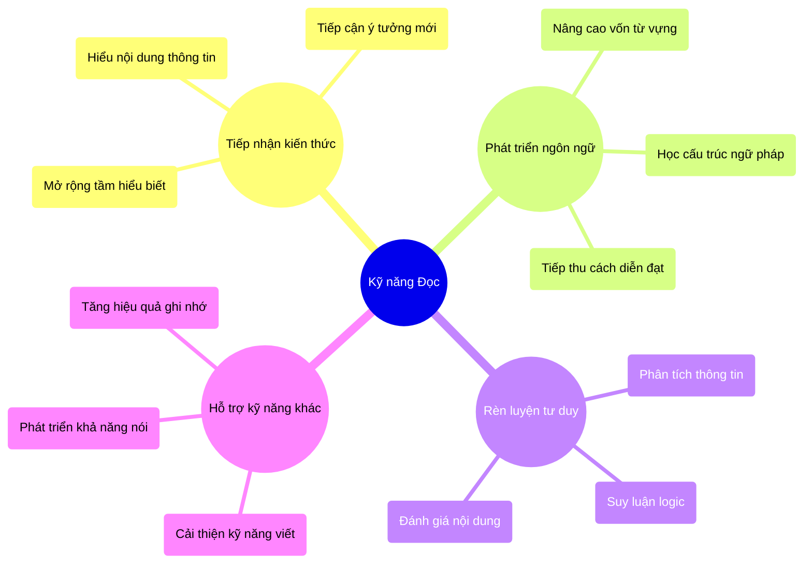

## 2. Các dạng bài đọc thường gặp

### 2.1. Đọc và trả lời câu hỏi

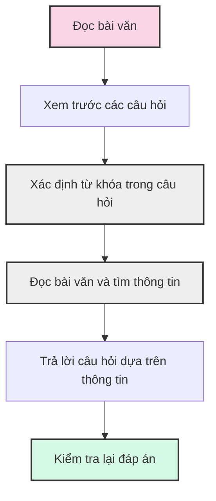

**Ví dụ**:
```
Read the passage and answer the questions:

THE SCHOOL LIBRARY

Our school library is on the second floor. It is open from Monday to Friday, from 8:00 AM to 4:30 PM. Students can borrow up to three books at a time for two weeks. The library has over 5,000 books, including fiction, non-fiction, reference books, and magazines. It also has computers for students to use for research.

Questions:
1. Where is the school library?
2. How many books can students borrow at one time?
3. What types of materials are available in the library?
```

**Lưu ý**:
- Đọc câu hỏi trước để biết cần tìm thông tin gì
- Xác định từ khóa trong câu hỏi (where, how many, what types)
- Tìm thông tin trong bài đọc có liên quan đến từ khóa
- Trả lời ngắn gọn, đúng trọng tâm câu hỏi

### 2.2. Đọc và chọn True/False/Not Given

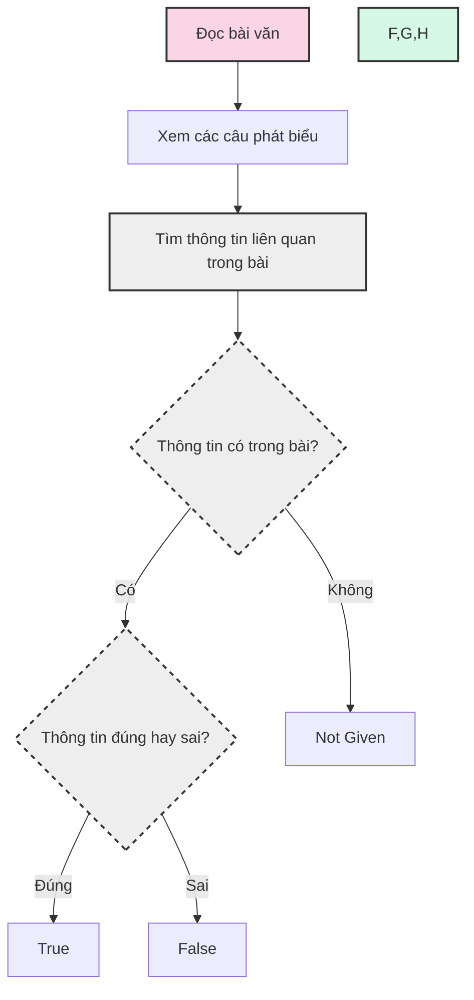

**Ví dụ**:
```
Read the passage and write T (True), F (False), or NG (Not Given):

MY PET DOG

I have a pet dog named Max. He is a brown Labrador and he is three years old. I got him when he was just a puppy. Max likes playing with a ball in the garden. He also enjoys swimming in the lake during summer. Max eats dog food and sometimes chicken. He sleeps in a basket next to my bed.

Statements:
1. Max is a black dog. [F]
2. Max is three years old. [T]
3. Max likes playing with other dogs. [NG]
4. Max sleeps in my bed. [F]
```

**Lưu ý**:
- True (T): Thông tin trong câu phát biểu khớp với thông tin trong bài đọc
- False (F): Thông tin trong câu phát biểu trái ngược với thông tin trong bài đọc
- Not Given (NG): Thông tin trong câu phát biểu không được nhắc đến trong bài đọc

### 2.3. Đọc và điền từ vào chỗ trống

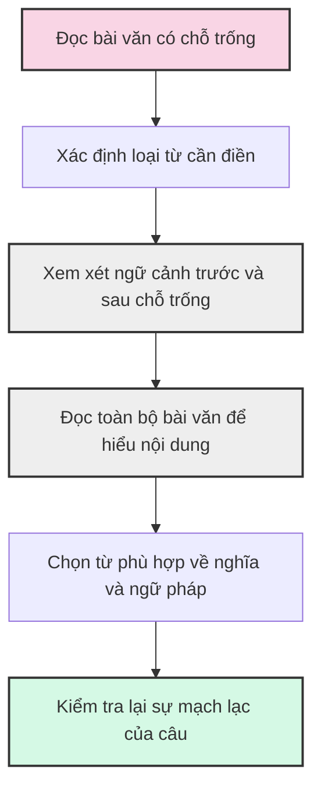

**Ví dụ**:
```
Read the passage and fill in the blanks with the words from the box:

healthy    favorite    morning    enjoys    friends

MY DAILY ROUTINE

I wake up at 6:30 in the _______ (1) every day. I eat a _______ (2) breakfast with fruits and milk. Then I go to school where I meet my _______ (3). My _______ (4) subject is Math. After school, my brother _______ (5) playing football in the park.
```

**Lưu ý**:
- Xác định loại từ cần điền (danh từ, động từ, tính từ...)
- Đảm bảo từ phù hợp về ngữ pháp (số ít/số nhiều, thì của động từ...)
- Đọc toàn bộ đoạn văn để hiểu nội dung tổng thể
- Kiểm tra lại sự mạch lạc của câu sau khi điền từ

## 3. Chiến lược đọc hiểu hiệu quả

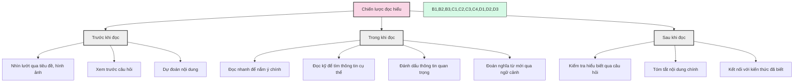

### 3.1. Các kỹ thuật đọc

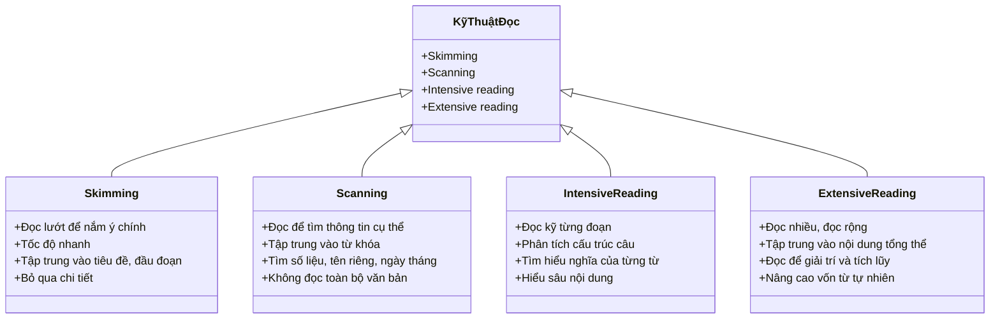

## 4. Lộ trình luyện đọc

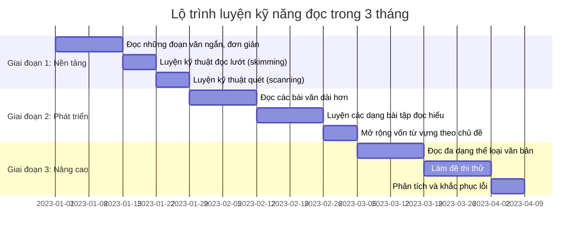

## 5. Các dạng câu hỏi đọc hiểu thường gặp

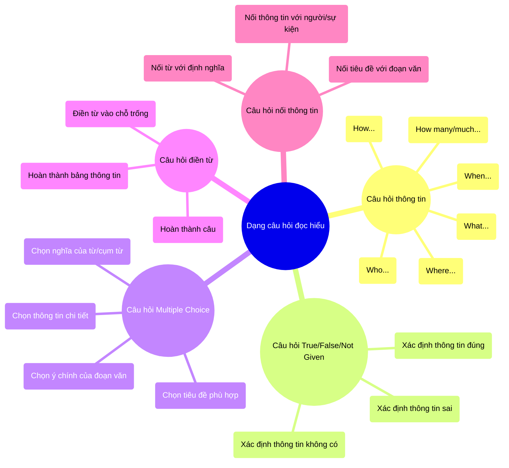

## 6. Các chủ đề đọc thường gặp

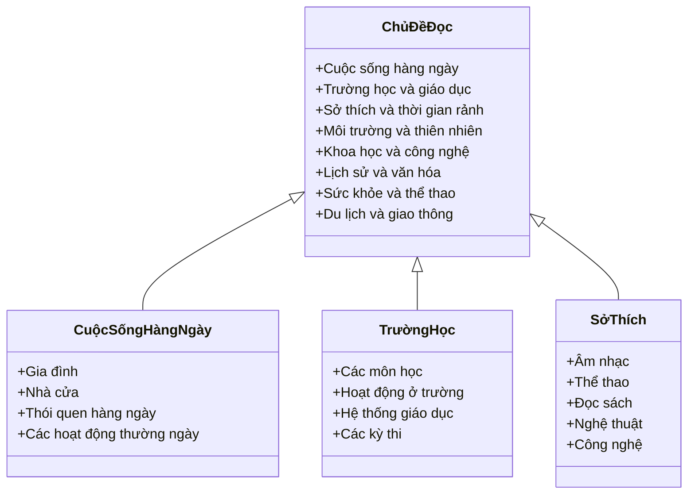

## 7. Phương pháp cải thiện kỹ năng đọc

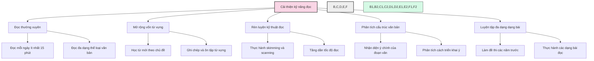

## 8. Các lỗi thường gặp khi làm bài đọc

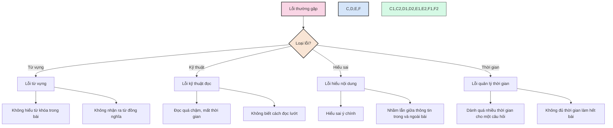

---

Kỹ năng đọc hiểu là một kỹ năng cần được rèn luyện thường xuyên và liên tục. Hãy tạo thói quen đọc tiếng Anh mỗi ngày, bắt đầu từ những bài đọc đơn giản và tăng dần độ khó. Đọc đa dạng thể loại sẽ giúp mở rộng vốn từ vựng và làm quen với nhiều cấu trúc ngữ pháp khác nhau. Kết hợp đọc với các kỹ năng khác như nghe, nói, viết sẽ giúp phát triển toàn diện khả năng tiếng Anh của bạn. 