# Từ vựng và Ngữ pháp Tiếng Anh

Từ vựng và ngữ pháp là hai thành phần cơ bản và thiết yếu trong việc học tiếng Anh. Trong kỳ thi vào lớp 6, phần này chiếm một tỷ trọng lớn trong đề thi và đánh giá khả năng sử dụng ngôn ngữ của học sinh.

## 1. Tầm quan trọng của từ vựng và ngữ pháp

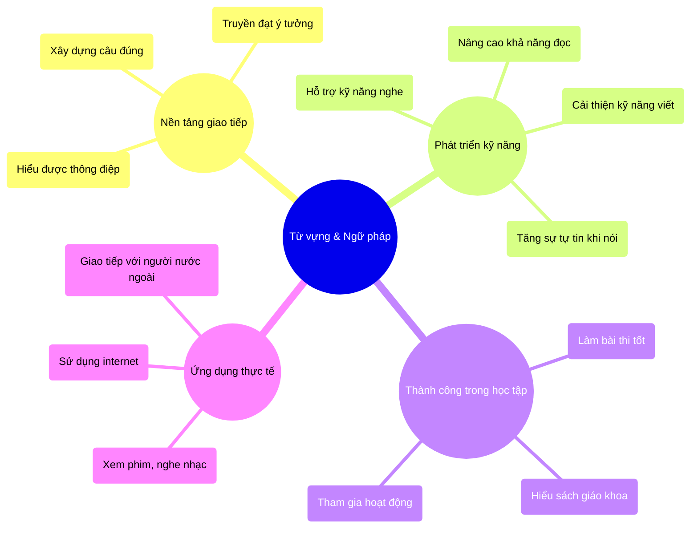

## 2. Các chủ đề từ vựng quan trọng

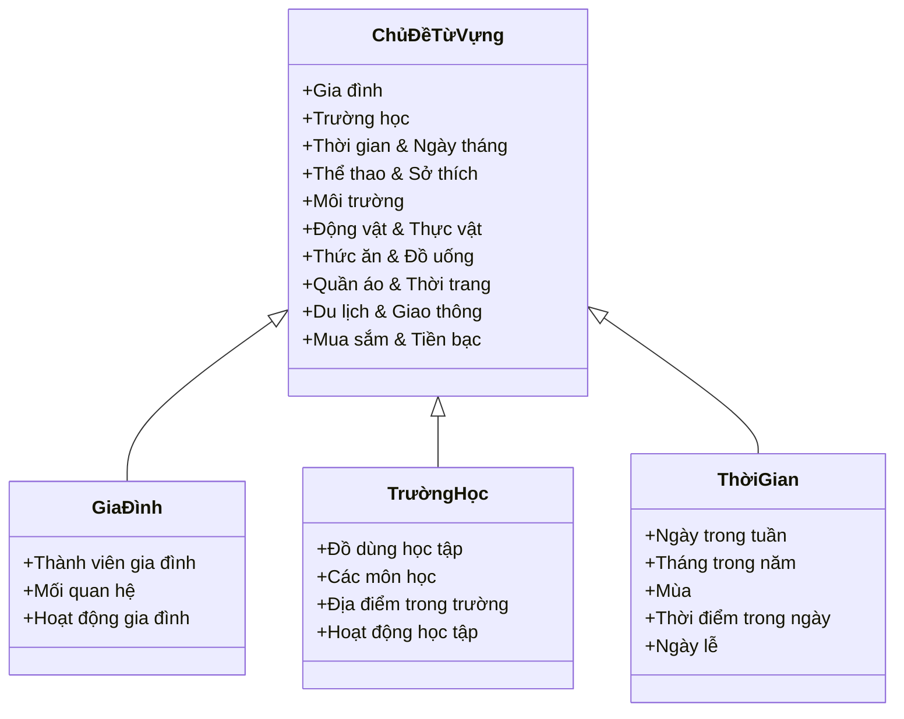

### 2.1. Phương pháp học từ vựng hiệu quả

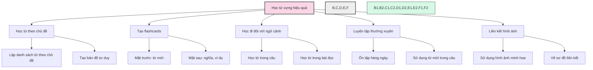

## 3. Các điểm ngữ pháp cơ bản

### 3.1. Thì (Tenses)

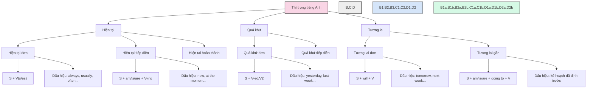

### 3.2. Từ loại (Parts of speech)

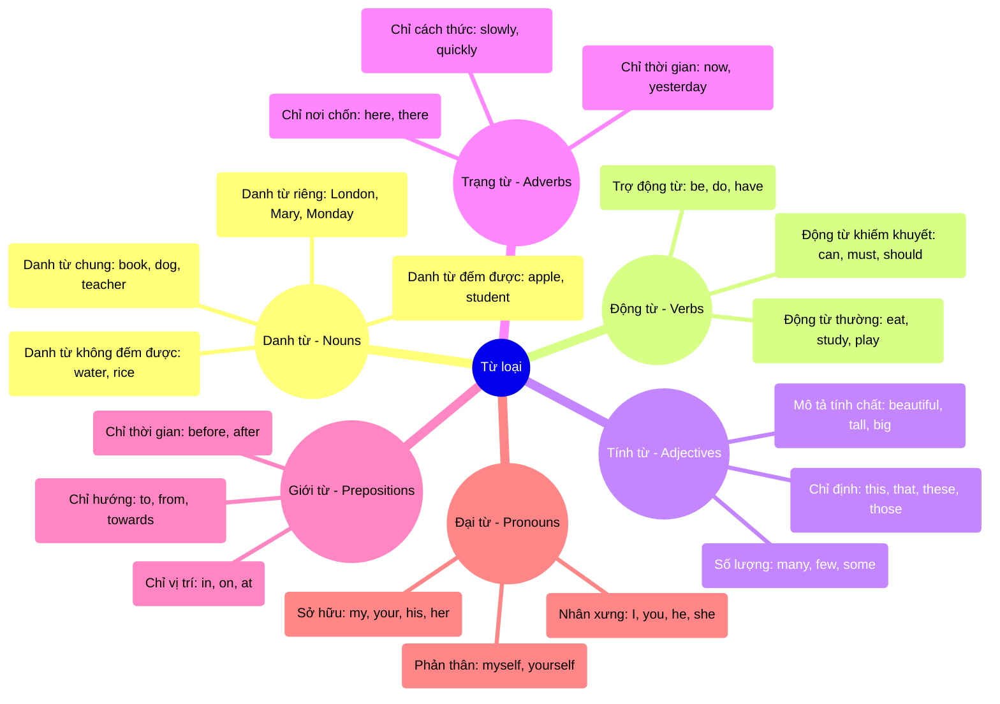

### 3.3. Câu điều kiện (Conditional Sentences)

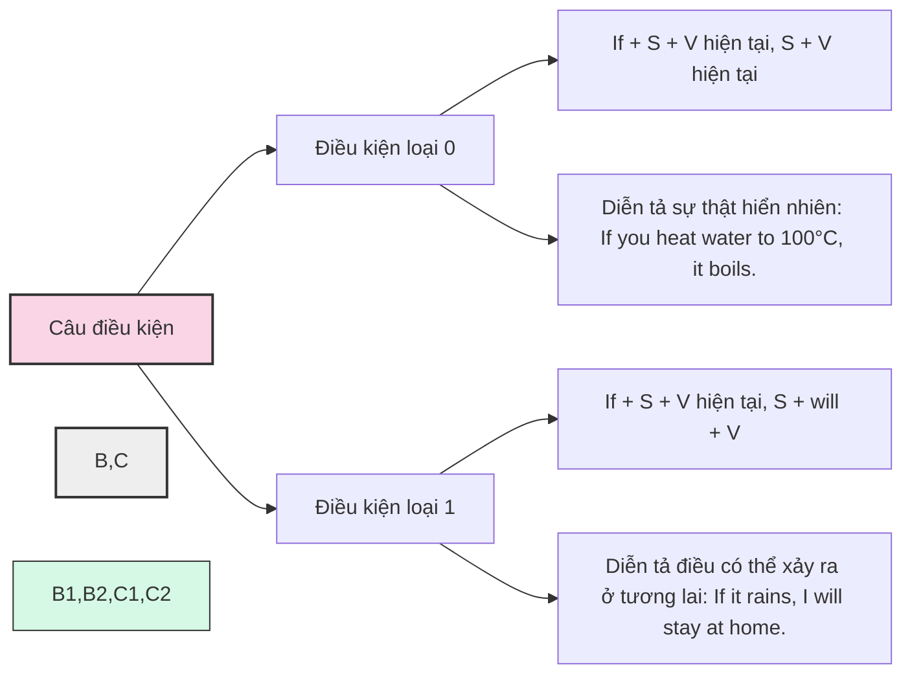

## 4. Các dạng bài tập thường gặp

### 4.1. Bài tập về từ vựng

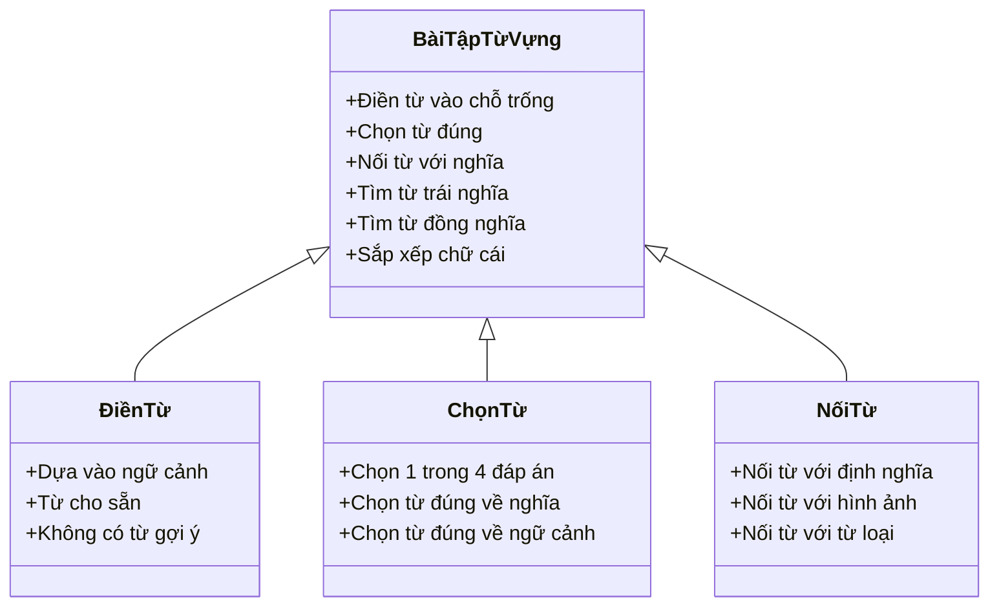

### 4.2. Bài tập về ngữ pháp

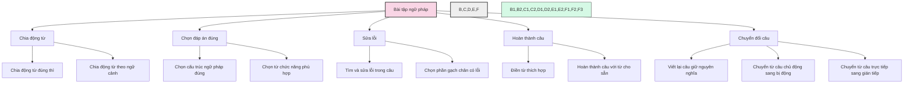

## 5. Chiến lược làm bài thi

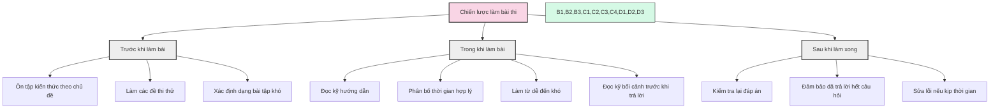

## 6. Lộ trình học từ vựng và ngữ pháp

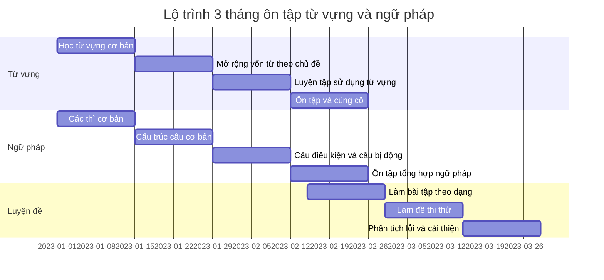

## 7. Các lỗi thường gặp và cách khắc phục

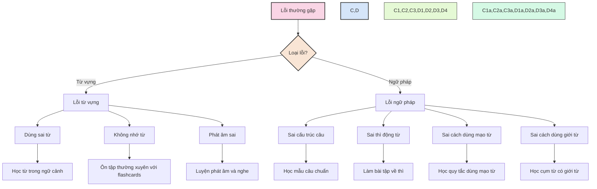

---

Để làm tốt phần từ vựng và ngữ pháp, học sinh cần học từng bước, luyện tập thường xuyên và áp dụng vào thực tế. Hãy tạo thói quen học từ mới mỗi ngày, làm bài tập ngữ pháp thường xuyên và đừng quên luyện tập tổng hợp qua các dạng bài thi thực tế. Ngoài ra, việc đọc sách, nghe nhạc, xem phim bằng tiếng Anh cũng giúp cải thiện vốn từ vựng và ngữ pháp một cách tự nhiên. 