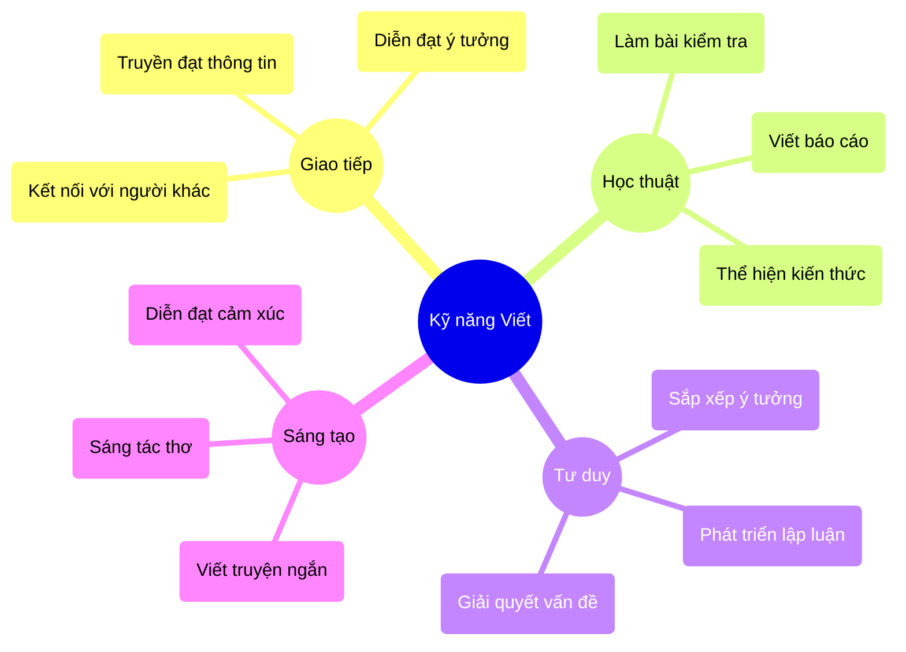
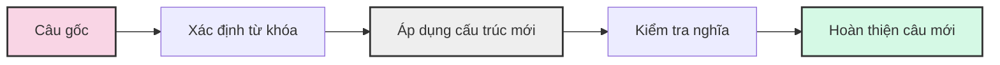
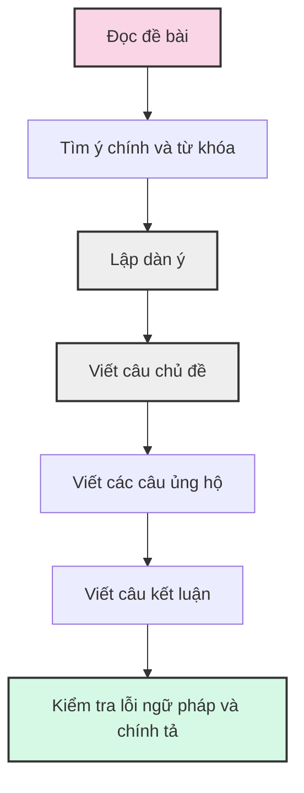
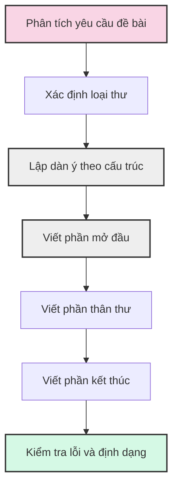
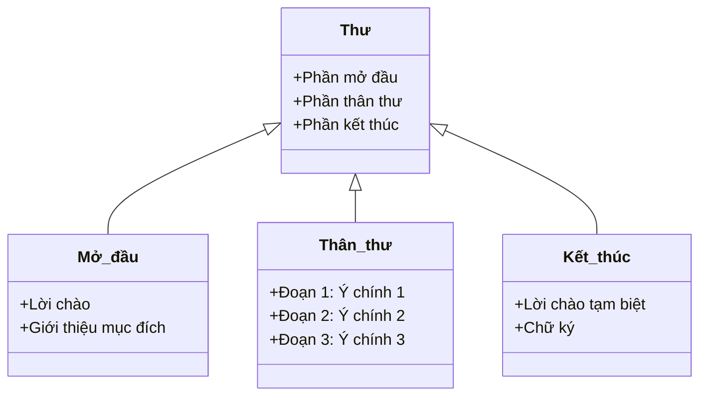
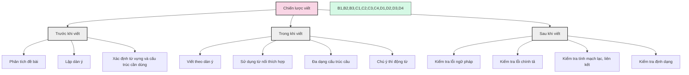
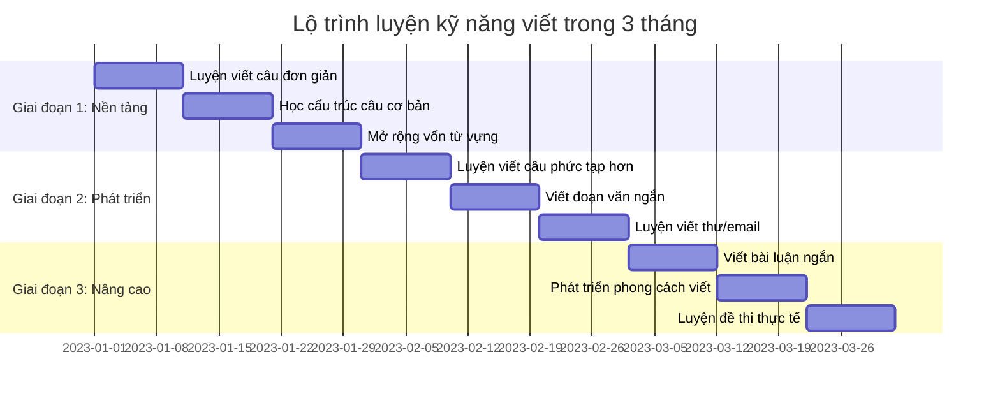
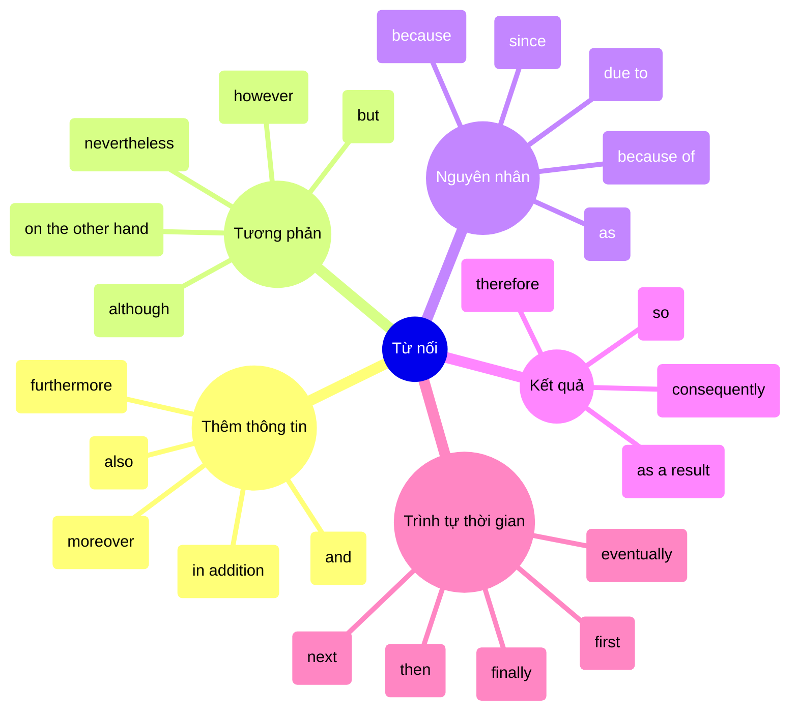
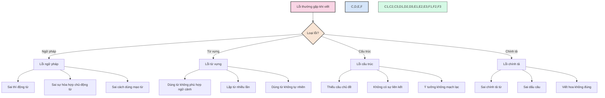
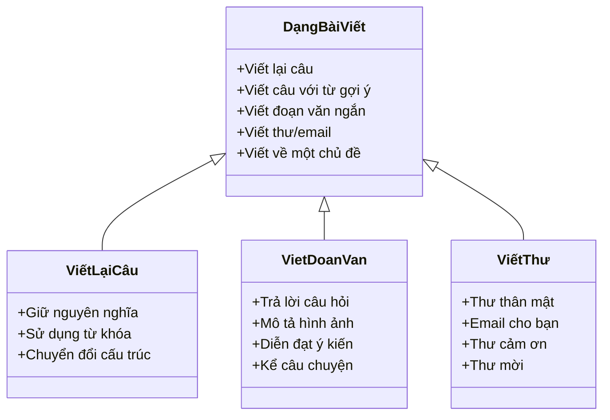

# Kỹ năng Viết (Writing)

Kỹ năng viết là một trong những kỹ năng quan trọng trong môn tiếng Anh, đòi hỏi sự kết hợp giữa từ vựng, ngữ pháp và khả năng diễn đạt ý tưởng một cách mạch lạc, logic.

## 1. Vai trò của kỹ năng viết



## 2. Các dạng bài viết thường gặp trong kỳ thi

### 2.1. Viết câu mới giữ nguyên nghĩa



**Ví dụ**:
```
Viết lại câu, bắt đầu với từ gợi ý sao cho nghĩa không đổi:
Câu gốc: Mary started learning English 3 years ago.
Từ gợi ý: has
Đáp án: Mary has been learning English for 3 years.
```

**Lưu ý**:
- Không thay đổi nghĩa của câu gốc
- Sử dụng đúng cấu trúc ngữ pháp mới
- Giữ nguyên thì của câu khi cần thiết
- Sử dụng đúng từ được cho trong phần gợi ý

### 2.2. Viết đoạn văn ngắn



**Cấu trúc đoạn văn cơ bản**:
- **Câu chủ đề** (Topic sentence): Giới thiệu ý chính của đoạn văn
- **Các câu ủng hộ** (Supporting sentences): Cung cấp ví dụ, lý do, dẫn chứng
- **Câu kết luận** (Concluding sentence): Tổng kết lại ý chính

### 2.3. Viết thư / email



**Cấu trúc thư cơ bản**:



## 3. Chiến lược viết hiệu quả



## 4. Lộ trình luyện viết



## 5. Từ nối trong tiếng Anh



## 6. Cách tránh lỗi viết phổ biến



## 7. Các dạng câu hỏi thường gặp trong kỳ thi



## 8. Các chủ đề thường gặp

1. **Bản thân và gia đình**: giới thiệu bản thân, thành viên gia đình, công việc nhà
2. **Trường học**: môn học yêu thích, hoạt động ngoại khóa, bạn bè
3. **Sở thích và thời gian rảnh**: thể thao, âm nhạc, phim ảnh, đọc sách
4. **Môi trường**: bảo vệ môi trường, tiết kiệm năng lượng, tái chế
5. **Công nghệ**: internet, điện thoại thông minh, trò chơi điện tử
6. **Du lịch**: địa điểm du lịch, phương tiện đi lại, ấn tượng về chuyến đi
7. **Văn hóa và lễ hội**: truyền thống, lễ hội địa phương, ẩm thực

---

Kỹ năng viết cần được rèn luyện thường xuyên và bạn cần phản hồi để cải thiện. Hãy tạo thói quen viết mỗi ngày, có thể là một đoạn văn ngắn, một bức thư hoặc thậm chí là một nhật ký bằng tiếng Anh. Đọc nhiều sẽ giúp bạn phát triển vốn từ và học cách diễn đạt ý tưởng một cách tự nhiên và mạch lạc. 