# Giải đố và tư duy sáng tạo

Giải đố và phát triển tư duy sáng tạo là những kỹ năng quan trọng giúp học sinh rèn luyện khả năng tư duy logic, linh hoạt và sáng tạo. Đây là những kỹ năng cần thiết không chỉ trong kỳ thi vào lớp 6 trường chuyên mà còn trong học tập và cuộc sống.

## 1. Tầm quan trọng của kỹ năng giải đố và tư duy sáng tạo

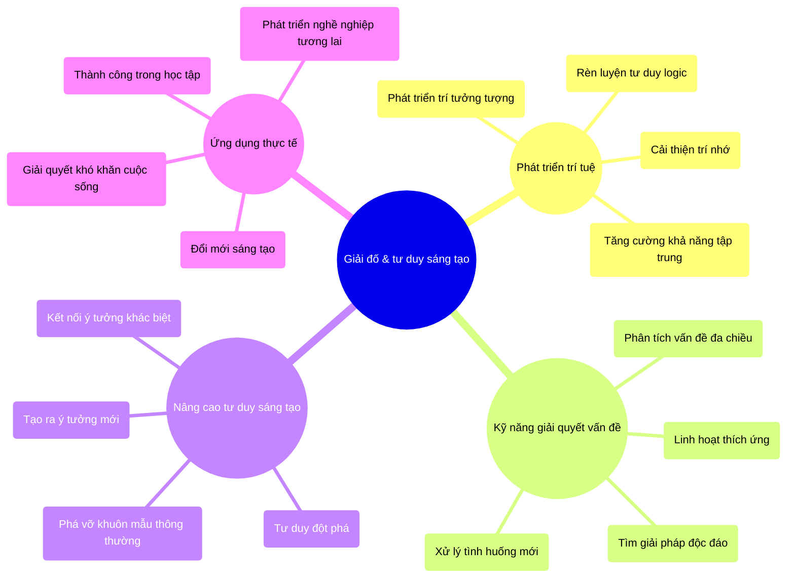

## 2. Các loại giải đố thường gặp

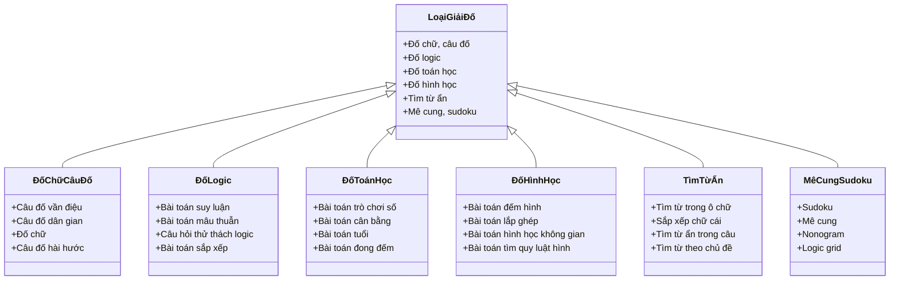

## 3. Chiến lược giải đố hiệu quả

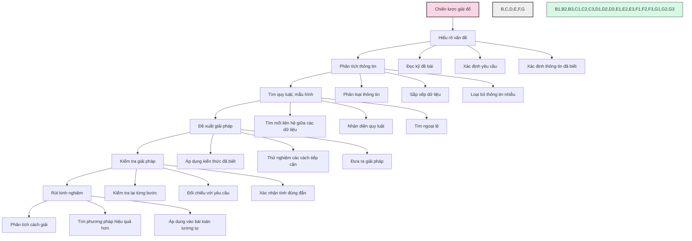

## 4. Các kỹ thuật tư duy sáng tạo

```mermaid
graph TD
    A[Kỹ thuật tư duy sáng tạo] --> B[Động não]
    A --> C[Tư duy phá cách]
    A --> D[Tư duy liên tưởng]
    A --> E[Tư duy ngược]
    A --> F[Tư duy bản đồ]
    
    B --> B1[Đưa ra nhiều ý tưởng]
    B --> B2[Không đánh giá sớm]
    B --> B3[Kết hợp ý tưởng]
    
    C --> C1[Phá vỡ khuôn mẫu]
    C --> C2[Đặt câu hỏi thách thức]
    C --> C3[Thay đổi góc nhìn]
    
    D --> D1[Tạo liên kết giữa ý tưởng]
    D --> D2[Sử dụng ẩn dụ, tương tự]
    D --> D3[Kết nối các lĩnh vực khác nhau]
    
    E --> E1[Bắt đầu từ kết quả mong muốn]
    E --> E2[Đi ngược về điểm xuất phát]
    E --> E3[Đảo ngược vấn đề]
    
    F --> F1[Vẽ bản đồ tư duy]
    F --> F2[Kết nối các khái niệm]
    F --> F3[Trực quan hóa ý tưởng]
    
    style A fill:#f9d5e5,stroke:#333,stroke-width:2px
    style B,C,D,E,F fill:#eeeeee,stroke:#333,stroke-width:2px
    style B1,B2,B3,C1,C2,C3,D1,D2,D3,E1,E2,E3,F1,F2,F3 fill:#d5f9e5,stroke:#333,stroke-width:1px
```

## 5. Ví dụ các dạng giải đố thường gặp trong kỳ thi

### 5.1. Tìm quy luật số

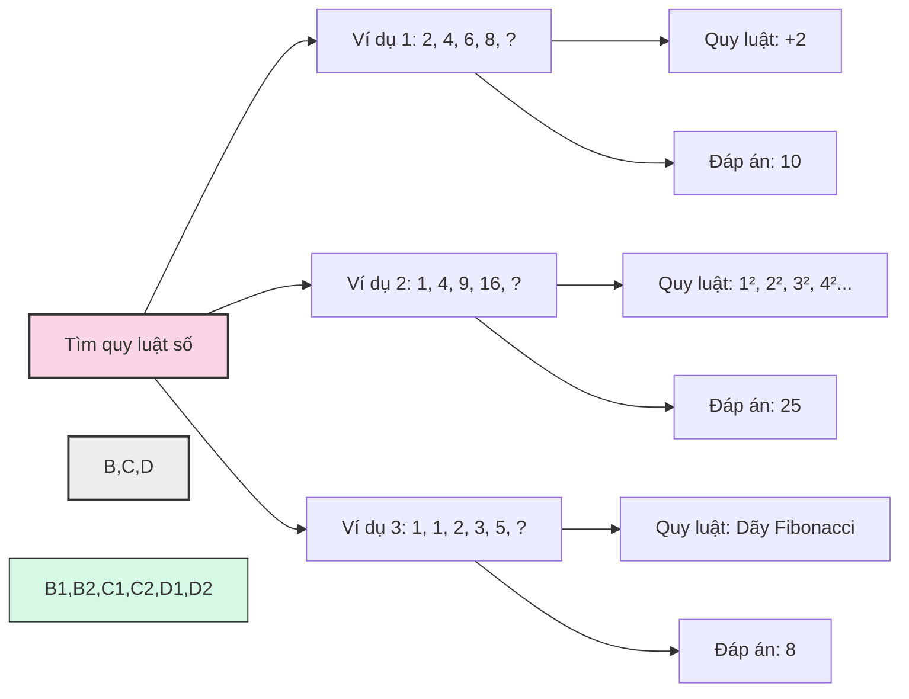

### 5.2. Đếm hình

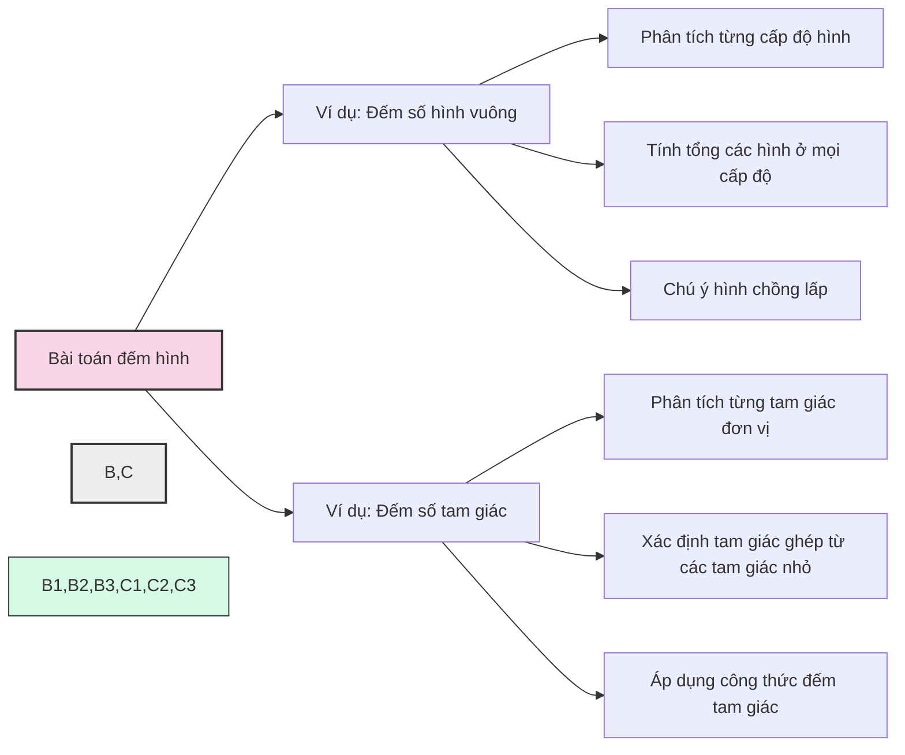

### 5.3. Sudoku và Logic grid

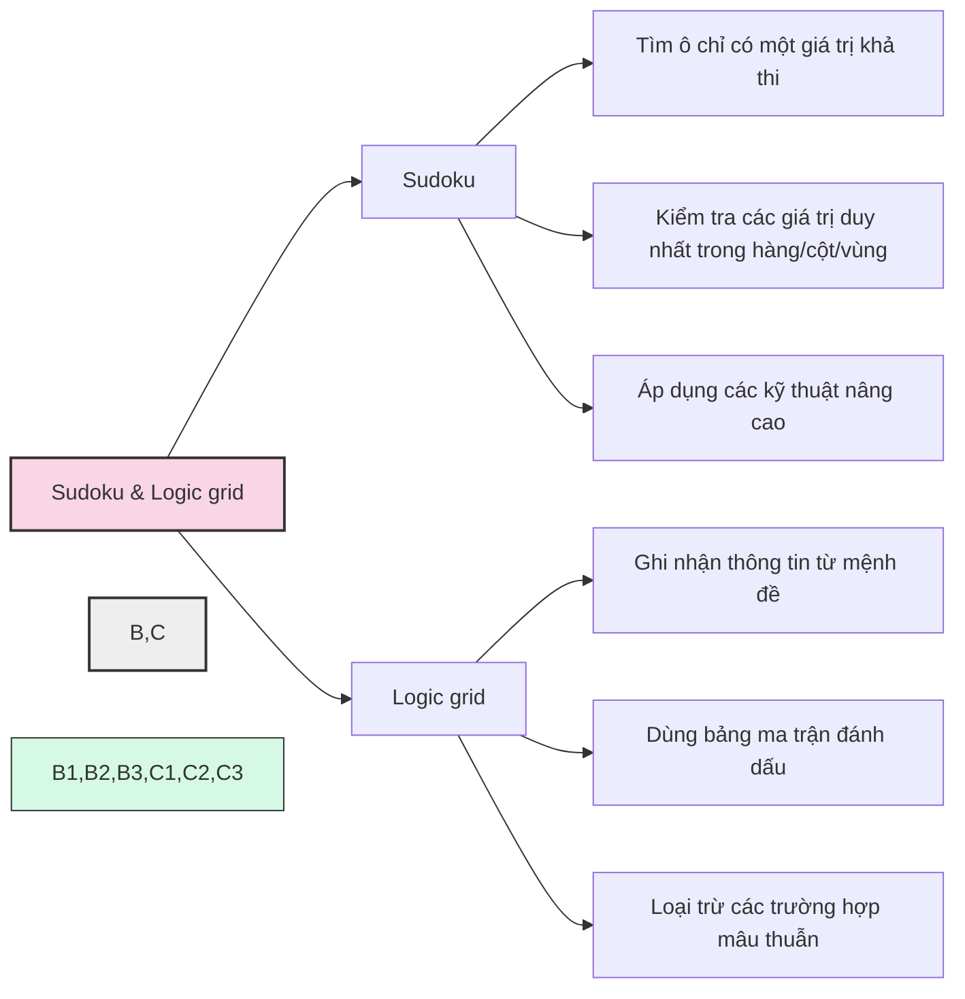

## 6. Phương pháp rèn luyện kỹ năng giải đố và tư duy sáng tạo

```mermaid
flowchart TD
    A[Rèn luyện kỹ năng] --> B[Luyện tập thường xuyên]
    A --> C[Mở rộng kiến thức]
    A --> D[Thử thách bản thân]
    A --> E[Học hỏi từ người khác]
    A --> F[Phản ánh và cải thiện]
    
    B --> B1[Giải đố hàng ngày]
    B --> B2[Tham gia câu lạc bộ logic, IQ]
    B --> B3[Làm bài tập nâng cao dần]
    
    C --> C1[Đọc sách về tư duy, giải đố]
    C --> C2[Tìm hiểu các phương pháp suy luận]
    C --> C3[Học các lý thuyết về tư duy sáng tạo]
    
    D --> D1[Giải các bài toán khó hơn]
    D --> D2[Tự đặt ra vấn đề để giải quyết]
    D --> D3[Tham gia các cuộc thi]
    
    E --> E1[Thảo luận nhóm]
    E --> E2[Học hỏi từ người giỏi hơn]
    E --> E3[Phân tích cách giải của người khác]
    
    F --> F1[Xem lại quá trình giải]
    F --> F2[Đánh giá điểm mạnh, điểm yếu]
    F --> F3[Điều chỉnh phương pháp học tập]
    
    style A fill:#f9d5e5,stroke:#333,stroke-width:2px
    style B,C,D,E,F fill:#eeeeee,stroke:#333,stroke-width:2px
    style B1,B2,B3,C1,C2,C3,D1,D2,D3,E1,E2,E3,F1,F2,F3 fill:#d5f9e5,stroke:#333,stroke-width:1px
```

## 7. Lộ trình rèn luyện kỹ năng giải đố

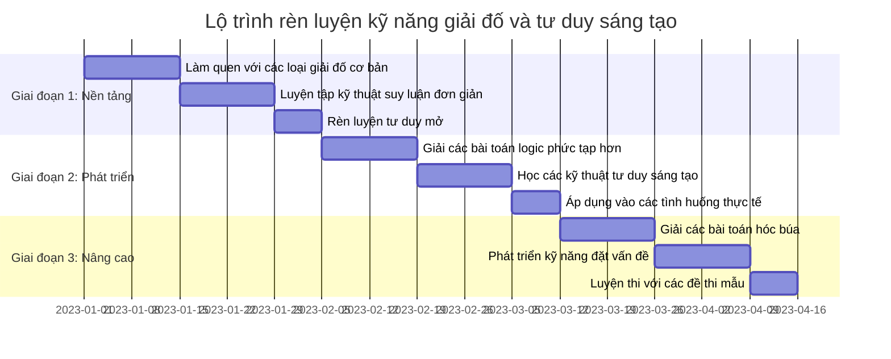

## 8. Ví dụ các bài giải đố có giải thích

```mermaid
graph TD
    A[Bài giải đố mẫu] --> B[Câu đố: Tìm số tiếp theo trong dãy: 3, 6, 9, 18, 27, ?]
    A --> C[Câu đố: Nhà nào luôn có cửa sổ nhưng không thể sống trong đó?]
    A --> D[Câu đố logic: Hai cha và hai con đi câu cá, bắt được 3 con cá. Mỗi người có một con, tại sao?]
    
    B --> B1[Phân tích: 3x2=6, 6+3=9, 9x2=18, 18+9=27]
    B1 --> B2[Quy luật: Nhân 2, cộng với số trước]
    B2 --> B3[Đáp án: 27x2=54]
    
    C --> C1[Phân tích từ khóa: "nhà", "cửa sổ", "không thể sống"]
    C1 --> C2[Tìm đối tượng có đặc điểm trên]
    C2 --> C3[Đáp án: Nhà máy tính (computer)]
    
    D --> D1[Nhận dạng khó khăn: Làm sao 3 người có 3 con cá?]
    D1 --> D2[Phân tích mối quan hệ: Ông, con trai, cháu trai]
    D2 --> D3[Đáp án: Họ là ông, cha và con - 3 người]
    
    style A fill:#f9d5e5,stroke:#333,stroke-width:2px
    style B,C,D fill:#eeeeee,stroke:#333,stroke-width:2px
    style B1,B2,B3,C1,C2,C3,D1,D2,D3 fill:#d5f9e5,stroke:#333,stroke-width:1px
```

## 9. Ứng dụng tư duy sáng tạo trong các môn học khác

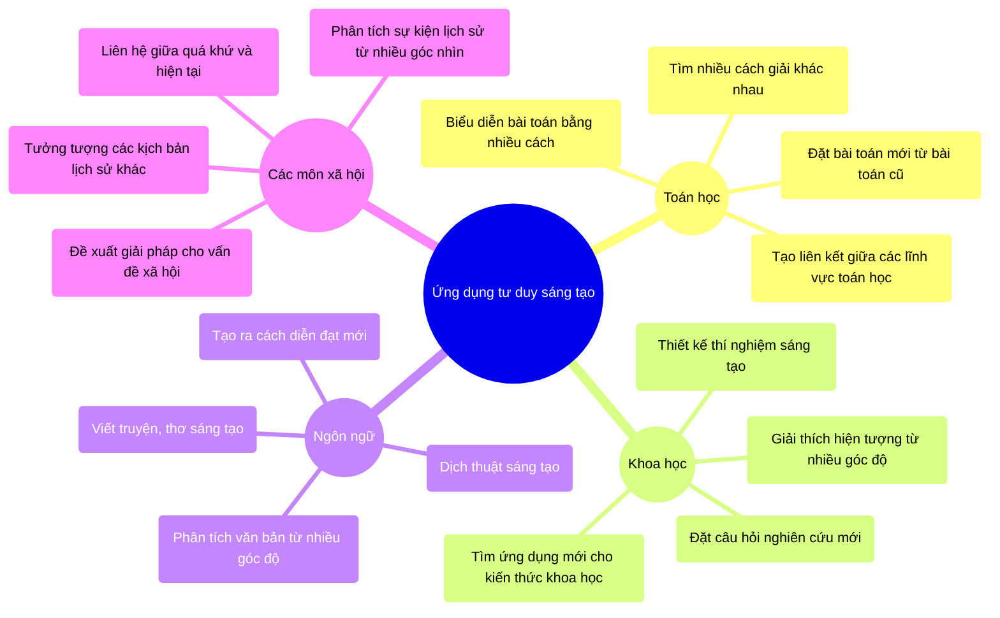

## 10. Những lợi ích lâu dài của việc rèn luyện kỹ năng giải đố và tư duy sáng tạo

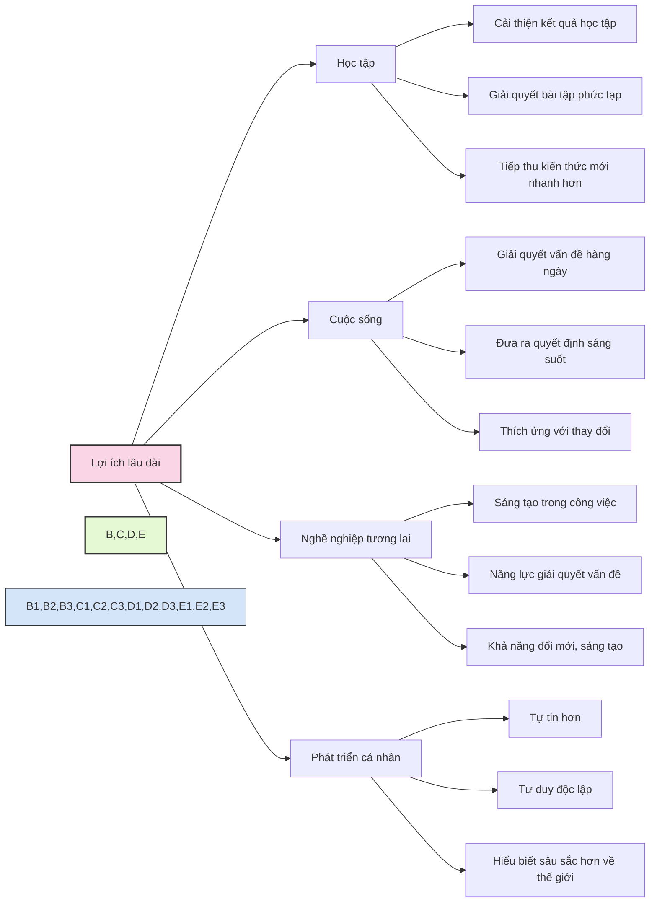

---

Giải đố và phát triển tư duy sáng tạo là những kỹ năng có thể rèn luyện được qua thời gian và nỗ lực. Không chỉ giúp học sinh đạt kết quả tốt trong kỳ thi vào lớp 6 trường chuyên, những kỹ năng này còn là nền tảng vững chắc cho sự phát triển toàn diện, giúp các em thành công trong học tập và cuộc sống tương lai. 