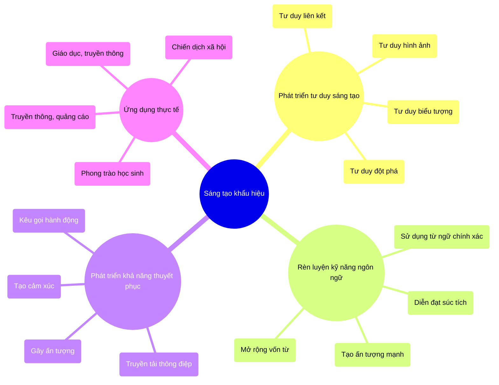
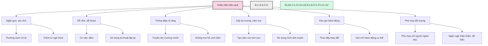
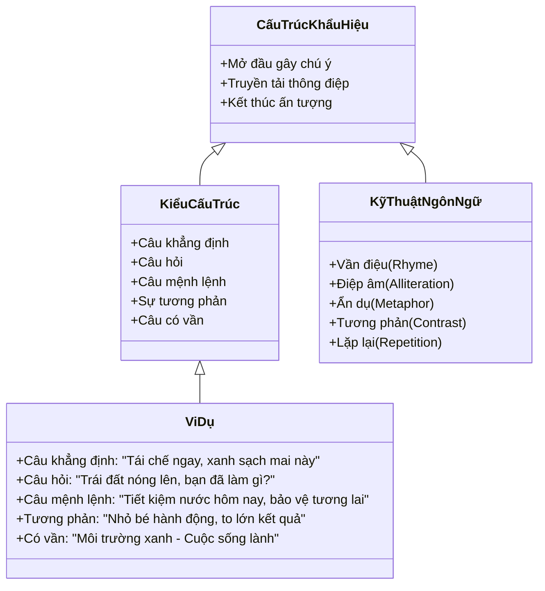
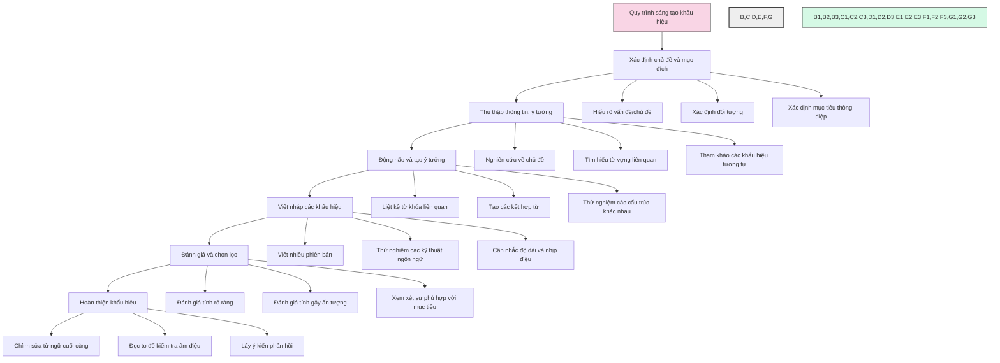
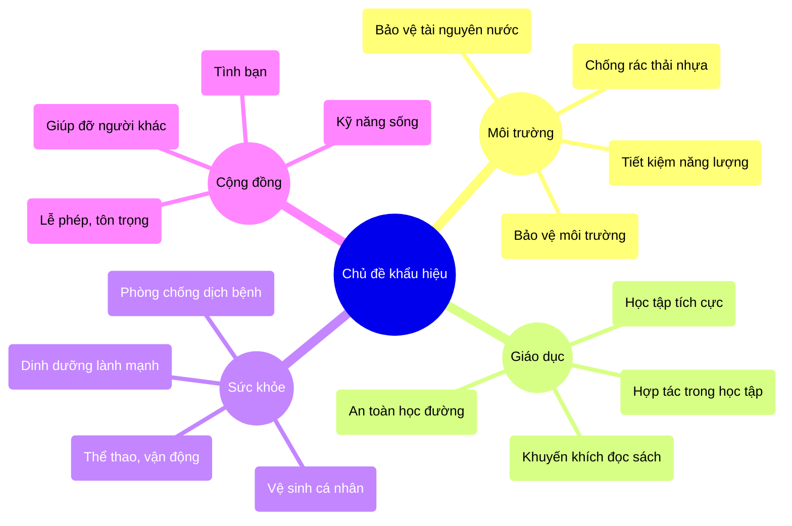
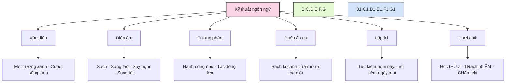
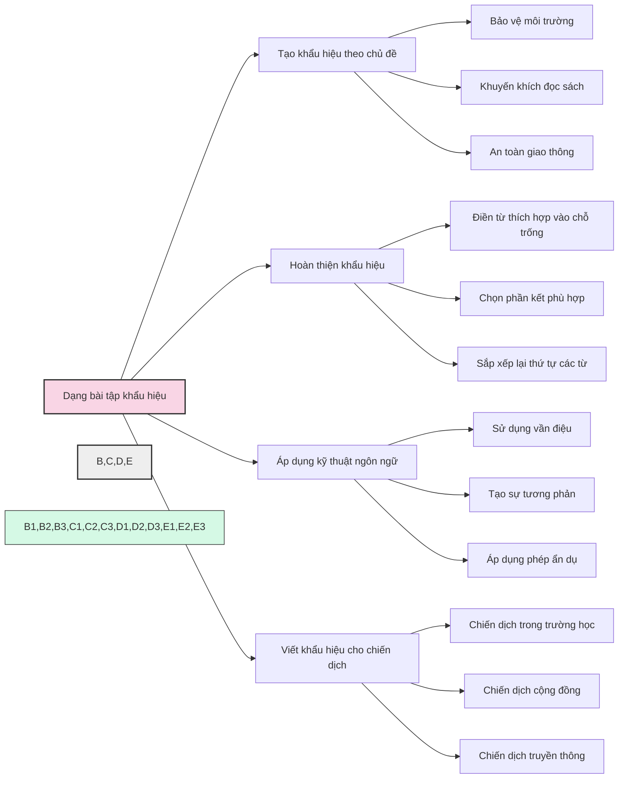
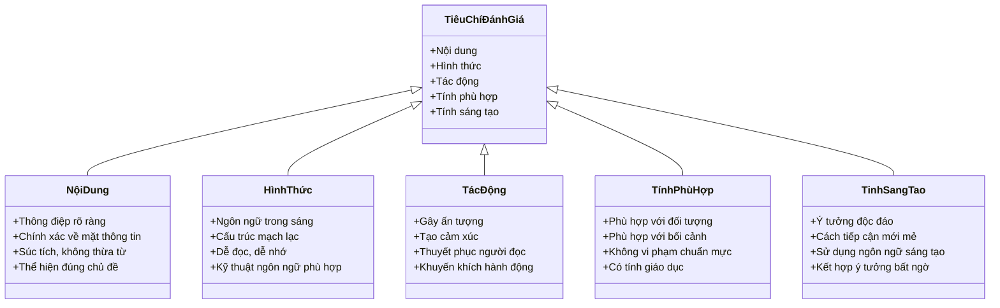

# Kỹ năng sáng tạo khẩu hiệu

Kỹ năng sáng tạo khẩu hiệu (slogan) là khả năng tạo ra những thông điệp ngắn gọn, ấn tượng và có tính thuyết phục về một chủ đề nào đó. Đây là một trong những kỹ năng thực hành quan trọng được đánh giá trong kỳ thi vào lớp 6 trường chuyên.

## 1. Tầm quan trọng của kỹ năng sáng tạo khẩu hiệu

## 2. Đặc điểm của khẩu hiệu hiệu quả

## 3. Cấu trúc của khẩu hiệu

## 4. Quy trình sáng tạo khẩu hiệu

## 5. Các chủ đề thường gặp cho khẩu hiệu

## 6. Kỹ thuật ngôn ngữ trong sáng tạo khẩu hiệu

## 7. Các dạng bài tập sáng tạo khẩu hiệu

## 8. Phương pháp rèn luyện kỹ năng sáng tạo khẩu hiệu

```mermaid
flowchart TD
    A[Rèn luyện kỹ năng sáng tạo khẩu hiệu] --> B[Đọc và thu thập]
    A --> C[Thực hành thường xuyên]
    A --> D[Phát triển vốn từ vựng]
    A --> E[Rèn luyện tư duy sáng tạo]
    A --> F[Nhận phản hồi và cải thiện]
    
    B --> B1[Đọc và sưu tầm khẩu hiệu hay]
    B --> B2[Phân tích cấu trúc, kỹ thuật]
    B --> B3[Tìm hiểu câu chuyện đằng sau]
    
    C --> C1[Viết khẩu hiệu hàng ngày]
    C --> C2[Thử thách với các chủ đề khác nhau]
    C --> C3[Tham gia các cuộc thi viết khẩu hiệu]
    
    D --> D1[Học từ đồng nghĩa, trái nghĩa]
    D --> D2[Tìm hiểu từ vựng chuyên ngành]
    D --> D3[Luyện tập với các từ mới]
    
    E --> E1[Luyện tập kỹ thuật động não]
    E --> E2[Tìm kết nối giữa các ý tưởng]
    E --> E3[Thử nghiệm các góc nhìn mới]
    
    F --> F1[Chia sẻ với bạn bè, giáo viên]
    F --> F2[Tự đánh giá dựa trên tiêu chí]
    F --> F3[Chỉnh sửa và cải thiện liên tục]
    
    style A fill:#f9d5e5,stroke:#333,stroke-width:2px
    style B,C,D,E,F fill:#eeeeee,stroke:#333,stroke-width:2px
    style B1,B2,B3,C1,C2,C3,D1,D2,D3,E1,E2,E3,F1,F2,F3 fill:#d5f9e5,stroke:#333,stroke-width:1px
```

## 9. Tiêu chí đánh giá khẩu hiệu

## 10. Ví dụ khẩu hiệu hay theo chủ đề

```mermaid
graph TD
    A[Ví dụ khẩu hiệu hay] --> B[Môi trường]
    A --> C[Giáo dục]
    A --> D[Sức khỏe]
    A --> E[Cộng đồng]
    
    B --> B1["Trồng cây hôm nay - Tạo bóng mát ngày mai"]
    B --> B2["Tiết kiệm điện - Sáng tương lai"]
    B --> B3["Mỗi giọt nước - Một hơi thở"]
    B --> B4["Nói không với túi nilon - Nói có với cuộc sống xanh"]
    
    C --> C1["Học hôm nay - Sáng tương lai"]
    C --> C2["Mỗi ngày một sách - Mỗi ngày một bước tiến"]
    C --> C3["Đọc càng nhiều - Biết càng rộng"]
    C --> C4["Lắng nghe - Chia sẻ - Học hỏi - Phát triển"]
    
    D --> D1["Vận động mỗi ngày - Khỏe mạnh mỗi phút"]
    D --> D2["Ăn đủ bữa - Uống đủ nước - Sống khỏe mạnh"]
    D --> D3["Răng trắng - Nụ cười tươi"]
    D --> D4["Sức khỏe tốt - Mọi thứ tốt"]
    
    E --> E1["Giúp nhau tiến bước - Cùng nhau thành công"]
    E --> E2["Khác biệt mà không xa cách"]
    E --> E3["Tôn trọng là nền tảng - Chia sẻ là tình thương"]
    E --> E4["Yêu thương lan tỏa - Cuộc sống tươi đẹp"]
    
    style A fill:#f9d5e5,stroke:#333,stroke-width:2px
    style B,C,D,E fill:#e5f9d5,stroke:#333,stroke-width:2px
    style B1,B2,B3,B4,C1,C2,C3,C4,D1,D2,D3,D4,E1,E2,E3,E4 fill:#d5e5f9,stroke:#333,stroke-width:1px
```

---

Kỹ năng sáng tạo khẩu hiệu không chỉ giúp học sinh đạt điểm cao trong kỳ thi mà còn phát triển tư duy sáng tạo, khả năng ngôn ngữ và sự nhạy bén với các vấn đề xã hội. Thông qua việc luyện tập thường xuyên và áp dụng các kỹ thuật ngôn ngữ phù hợp, học sinh có thể tạo ra những khẩu hiệu ấn tượng, súc tích và có giá trị truyền thông cao. 