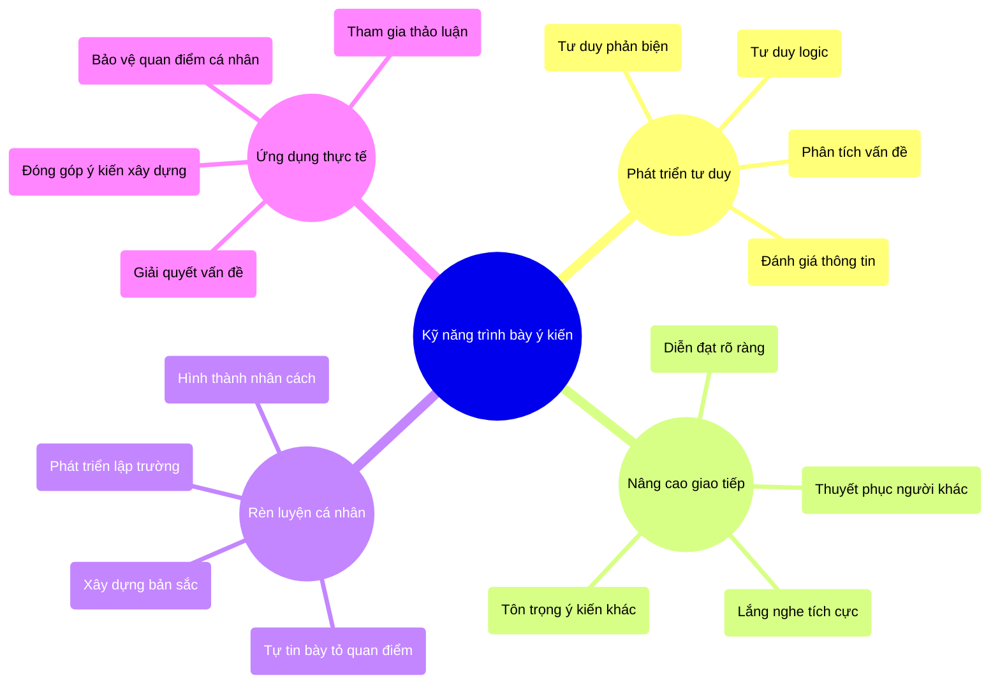
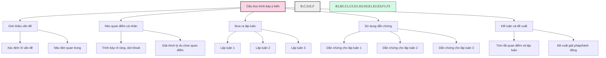
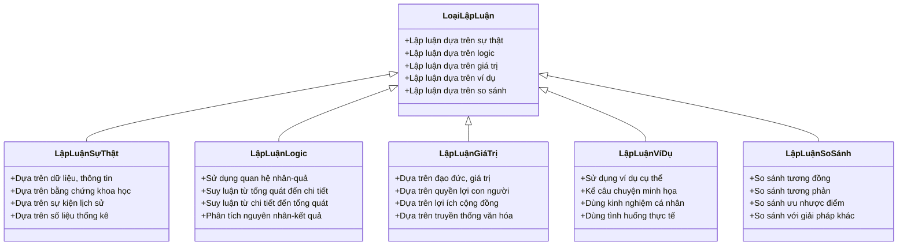
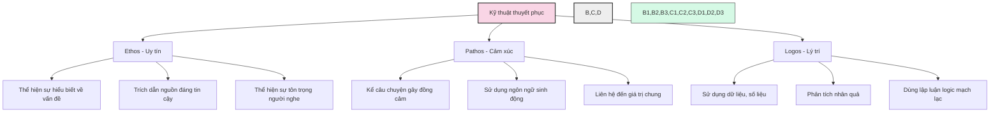
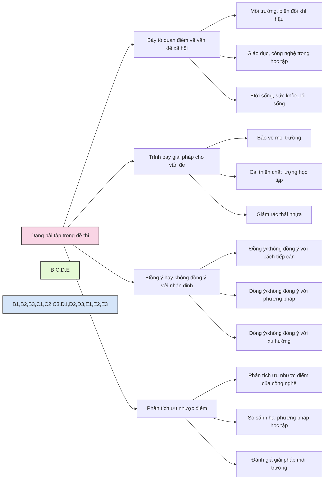
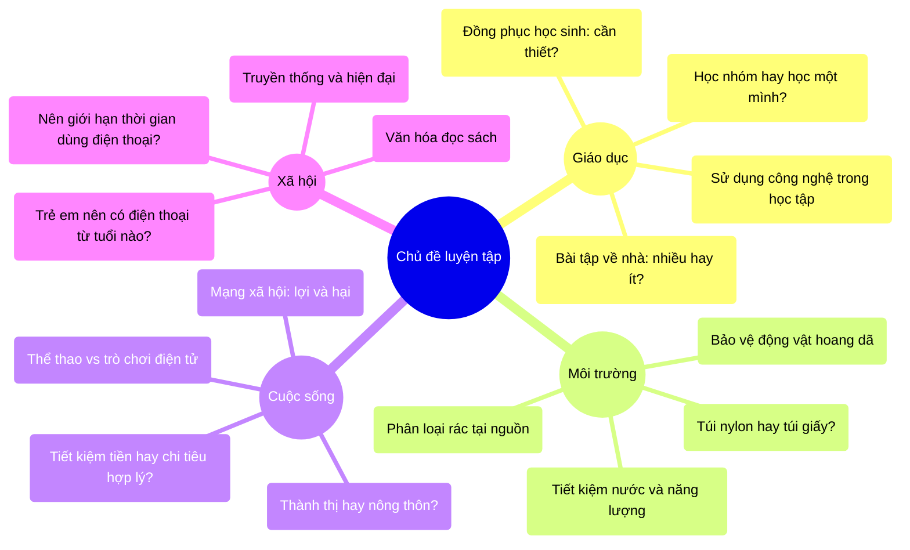
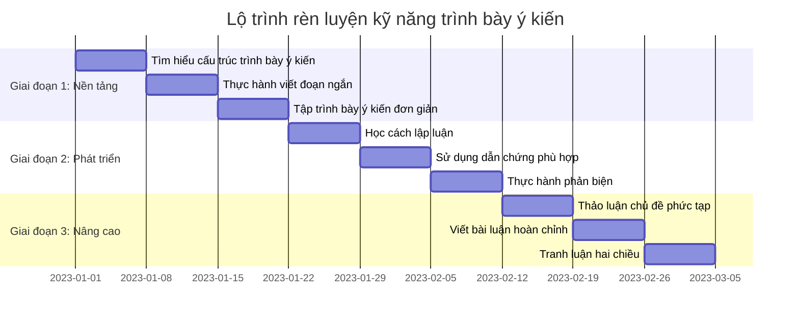
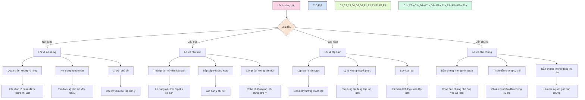

# Kỹ năng trình bày ý kiến

Kỹ năng trình bày ý kiến là khả năng diễn đạt quan điểm của bản thân một cách rõ ràng, hợp lý và thuyết phục. Đây là một trong những kỹ năng thiết yếu trong học tập và cuộc sống, đặc biệt quan trọng trong kỳ thi vào lớp 6 trường chuyên.

## 1. Tầm quan trọng của kỹ năng trình bày ý kiến

## 2. Cấu trúc trình bày ý kiến hiệu quả

## 3. Các loại lập luận hiệu quả

## 4. Kỹ thuật thuyết phục trong trình bày ý kiến

## 5. Các dạng bài tập trình bày ý kiến thường gặp

## 6. Phương pháp rèn luyện kỹ năng trình bày ý kiến

```mermaid
flowchart TD
    A[Rèn luyện kỹ năng trình bày ý kiến] --> B[Đọc và tìm hiểu]
    A --> C[Thực hành viết]
    A --> D[Thực hành nói]
    A --> E[Lắng nghe và phản biện]
    A --> F[Áp dụng vào thực tế]
    
    B --> B1[Đọc nhiều về các chủ đề xã hội]
    B --> B2[Phân tích cách lập luận trong bài báo]
    B --> B3[Học hỏi từ các bài luận mẫu]
    
    C --> C1[Viết nhật ký ý kiến]
    C --> C2[Tập viết đoạn văn trình bày quan điểm]
    C --> C3[Viết bài luận ngắn về các vấn đề]
    
    D --> D1[Tham gia thảo luận nhóm]
    D --> D2[Trình bày ý kiến trước lớp]
    D --> D3[Tranh luận về các chủ đề đơn giản]
    
    E --> E1[Lắng nghe ý kiến người khác]
    E --> E2[Tìm điểm mạnh/yếu trong lập luận]
    E --> E3[Đưa ra phản biện mang tính xây dựng]
    
    F --> F1[Áp dụng vào giải quyết vấn đề thực tế]
    F --> F2[Tham gia hoạt động ngoại khóa]
    F --> F3[Viết thư góp ý, đề xuất]
    
    style A fill:#f9d5e5,stroke:#333,stroke-width:2px
    style B,C,D,E,F fill:#eeeeee,stroke:#333,stroke-width:2px
    style B1,B2,B3,C1,C2,C3,D1,D2,D3,E1,E2,E3,F1,F2,F3 fill:#d5f9e5,stroke:#333,stroke-width:1px
```

## 7. Các chủ đề phù hợp để luyện tập

## 8. Lộ trình rèn luyện kỹ năng trình bày ý kiến

## 9. Những lỗi thường gặp và cách khắc phục

---

Kỹ năng trình bày ý kiến là một trong những năng lực quan trọng không chỉ trong học tập mà còn trong cuộc sống. Việc phát triển khả năng này sẽ giúp học sinh tự tin hơn, biết cách bảo vệ quan điểm của mình một cách thuyết phục và tôn trọng ý kiến của người khác. Đây là nền tảng quan trọng để phát triển tư duy phản biện và kỹ năng giải quyết vấn đề trong tương lai. 