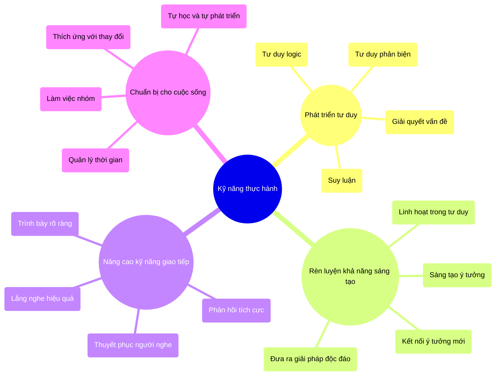
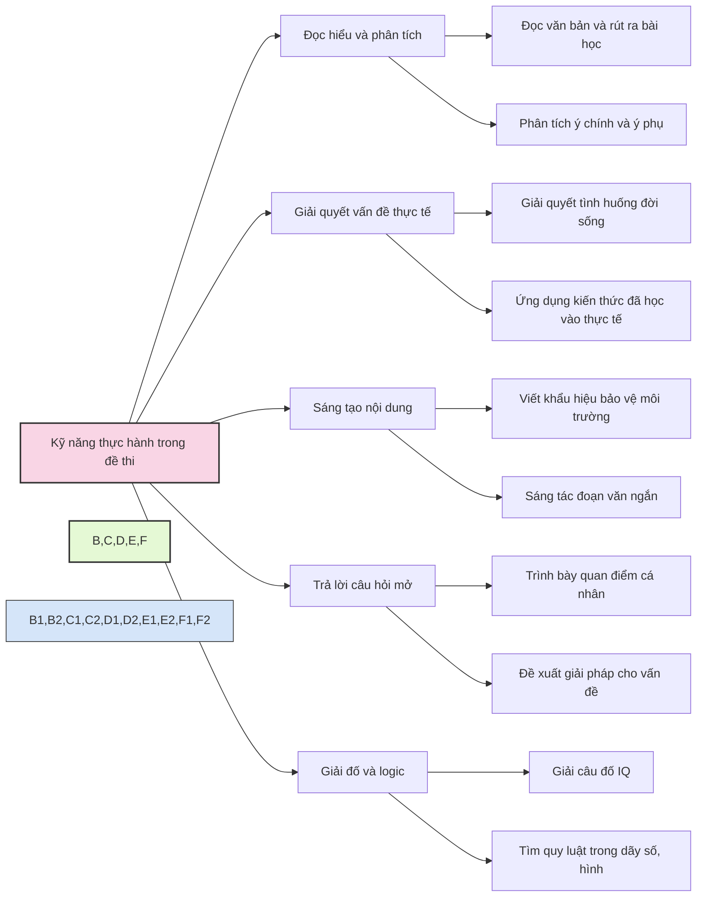
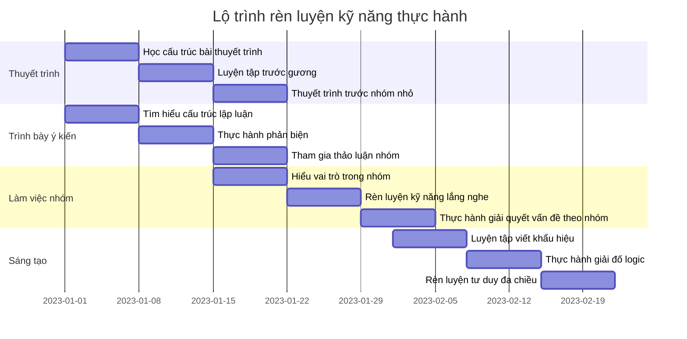
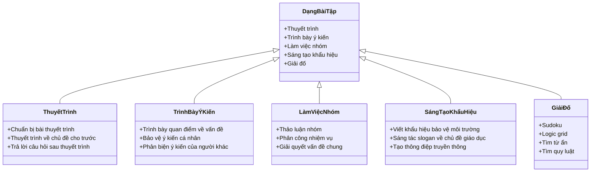
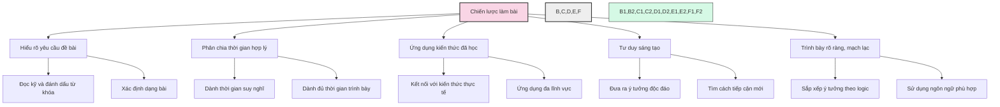

# Kỹ năng thực hành

Kỹ năng thực hành là một phần quan trọng trong kỳ thi tuyển sinh vào lớp 6 trường chuyên. Các kỹ năng này giúp học sinh thể hiện năng lực giải quyết vấn đề, tư duy sáng tạo, và khả năng vận dụng kiến thức vào tình huống thực tế.

## 1. Tầm quan trọng của kỹ năng thực hành

## 2. Các kỹ năng thực hành chính

```mermaid
graph TD
    A[Kỹ năng thực hành chính] --> B[Kỹ năng thuyết trình]
    A --> C[Kỹ năng trình bày ý kiến]
    A --> D[Kỹ năng làm việc nhóm]
    A --> E[Sáng tạo khẩu hiệu]
    A --> F[Giải đố và tư duy sáng tạo]
    
    B --> B1[Cấu trúc bài thuyết trình]
    B --> B2[Sử dụng ngôn ngữ thuyết phục]
    B --> B3[Tự tin trước đám đông]
    
    C --> C1[Trình bày ý kiến có lập luận]
    C --> C2[Sử dụng dẫn chứng thực tế]
    C --> C3[Phản biện có tính xây dựng]
    
    D --> D1[Phân chia vai trò nhóm]
    D --> D2[Lắng nghe và tôn trọng]
    D --> D3[Đóng góp ý tưởng]
    
    E --> E1[Hiểu bản chất vấn đề]
    E --> E2[Tạo thông điệp ngắn gọn, súc tích]
    E --> E3[Sử dụng ngôn ngữ sáng tạo]
    
    F --> F1[Giải câu đố logic]
    F --> F2[Tìm quy luật, mẫu hình]
    F --> F3[Đưa ra giải pháp sáng tạo]
    
    style A fill:#f9d5e5,stroke:#333,stroke-width:2px
    style B,C,D,E,F fill:#eeeeee,stroke:#333,stroke-width:2px
    style B1,B2,B3,C1,C2,C3,D1,D2,D3,E1,E2,E3,F1,F2,F3 fill:#d5f9e5,stroke:#333,stroke-width:1px
```

## 3. Vai trò trong kỳ thi

Kỹ năng thực hành đóng vai trò quan trọng trong kỳ thi vào lớp 6 chuyên với các dạng bài tập sau:

## 4. Phương pháp rèn luyện

## 5. Các dạng bài tập thường gặp

## 6. Chiến lược làm bài hiệu quả

---

Kỹ năng thực hành là phần không thể thiếu trong quá trình chuẩn bị cho kỳ thi tuyển sinh vào lớp 6 trường chuyên. Việc rèn luyện các kỹ năng này không chỉ giúp học sinh đạt điểm cao trong kỳ thi mà còn phát triển các kỹ năng cần thiết cho học tập và cuộc sống trong tương lai. 