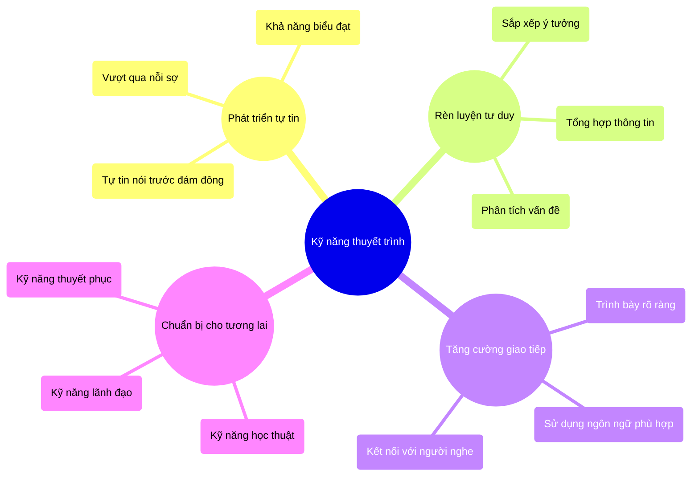
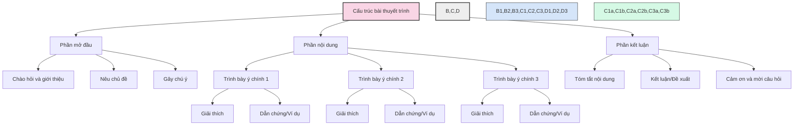
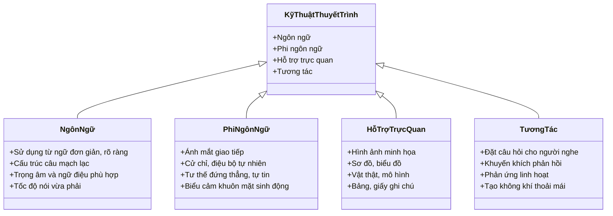
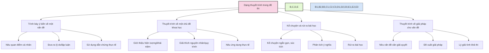
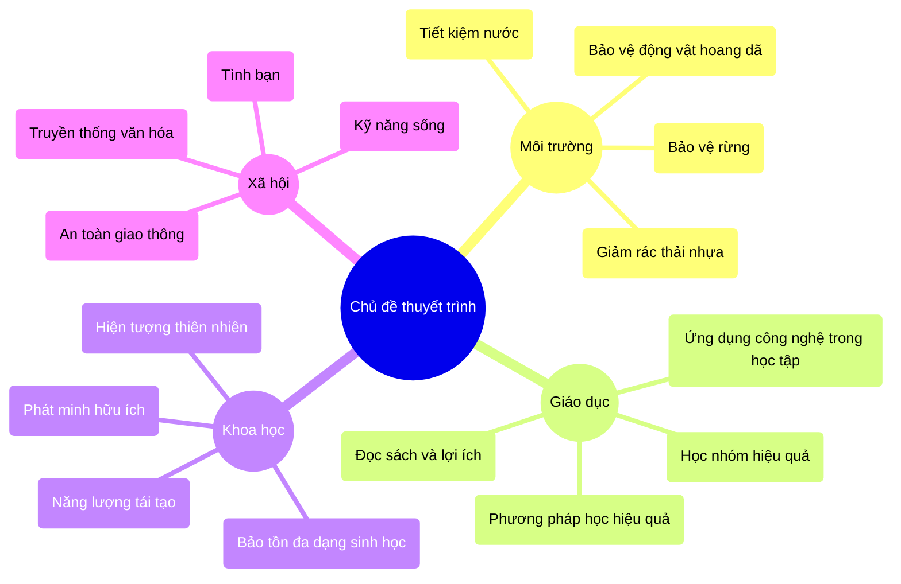
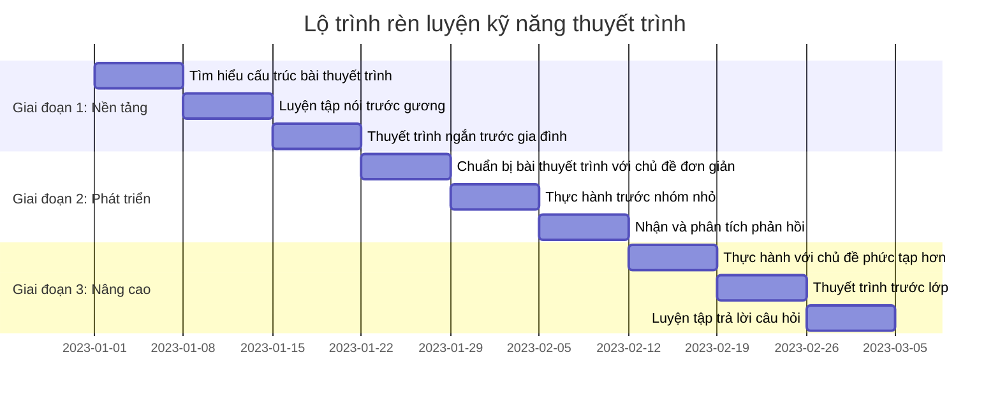

# Kỹ năng thuyết trình

Kỹ năng thuyết trình là khả năng trình bày thông tin, ý tưởng một cách rõ ràng, mạch lạc và thuyết phục trước người nghe. Đây là một trong những kỹ năng quan trọng được đánh giá trong kỳ thi vào lớp 6 trường chuyên.

## 1. Tầm quan trọng của kỹ năng thuyết trình

## 2. Cấu trúc bài thuyết trình hiệu quả

## 3. Kỹ thuật thuyết trình hiệu quả

## 4. Các dạng thuyết trình thường gặp trong kỳ thi

## 5. Phương pháp rèn luyện kỹ năng thuyết trình

```mermaid
flowchart TD
    A[Rèn luyện kỹ năng thuyết trình] --> B[Chuẩn bị kỹ nội dung]
    A --> C[Thực hành thường xuyên]
    A --> D[Rèn luyện kỹ năng giao tiếp]
    A --> E[Học từ người khác]
    A --> F[Xử lý tình huống]
    
    B --> B1[Nghiên cứu chủ đề kỹ lưỡng]
    B --> B2[Lập dàn ý chi tiết]
    B --> B3[Chuẩn bị câu trả lời cho câu hỏi]
    
    C --> C1[Thực hành trước gương]
    C --> C2[Ghi âm/quay video để phân tích]
    C --> C3[Thuyết trình trước người thân, bạn bè]
    
    D --> D1[Tham gia các hoạt động nhóm]
    D --> D2[Luyện tập phát âm, ngữ điệu]
    D --> D3[Rèn kỹ năng kể chuyện]
    
    E --> E1[Xem các bài thuyết trình mẫu]
    E --> E2[Học hỏi từ giáo viên, bạn bè]
    E --> E3[Nhận và áp dụng phản hồi]
    
    F --> F1[Xử lý câu hỏi bất ngờ]
    F --> F2[Đối phó với lo lắng, hồi hộp]
    F --> F3[Ứng biến khi quên nội dung]
    
    style A fill:#f9d5e5,stroke:#333,stroke-width:2px
    style B,C,D,E,F fill:#eeeeee,stroke:#333,stroke-width:2px
    style B1,B2,B3,C1,C2,C3,D1,D2,D3,E1,E2,E3,F1,F2,F3 fill:#d5f9e5,stroke:#333,stroke-width:1px
```

## 6. Một số chủ đề thuyết trình phù hợp để luyện tập

## 7. Lộ trình rèn luyện kỹ năng thuyết trình

## 8. Tiêu chí đánh giá bài thuyết trình

```mermaid
flowchart TD
    A[Tiêu chí đánh giá] --> B[Nội dung]
    A --> C[Trình bày]
    A --> D[Ngôn ngữ]
    A --> E[Hình thức]
    A --> F[Xử lý tình huống]
    
    B --> B1[Phù hợp với chủ đề]
    B --> B2[Thông tin chính xác]
    B --> B3[Sắp xếp logic]
    B --> B4[Ví dụ minh họa phù hợp]
    
    C --> C1[Rõ ràng, mạch lạc]
    C --> C2[Tự tin]
    C --> C3[Sinh động, hấp dẫn]
    
    D --> D1[Từ ngữ phù hợp]
    D --> D2[Phát âm rõ ràng]
    D --> D3[Ngữ điệu phù hợp]
    
    E --> E1[Tư thế, cử chỉ]
    E --> E2[Ánh mắt giao tiếp]
    E --> E3[Sử dụng công cụ hỗ trợ]
    
    F --> F1[Trả lời câu hỏi]
    F --> F2[Xử lý tình huống bất ngờ]
    F --> F3[Ứng biến linh hoạt]
    
    style A fill:#f9d5e5,stroke:#333,stroke-width:2px
    style B,C,D,E,F fill:#e5f9d5,stroke:#333,stroke-width:2px
    style B1,B2,B3,B4,C1,C2,C3,D1,D2,D3,E1,E2,E3,F1,F2,F3 fill:#d5e5f9,stroke:#333,stroke-width:1px
```

---

Kỹ năng thuyết trình không chỉ quan trọng trong kỳ thi mà còn là kỹ năng cần thiết trong cuộc sống. Việc rèn luyện thường xuyên và có phương pháp sẽ giúp học sinh tự tin hơn, trình bày ý tưởng hiệu quả hơn, đồng thời phát triển nhiều kỹ năng khác như tư duy logic, khả năng tổng hợp thông tin và giao tiếp. 