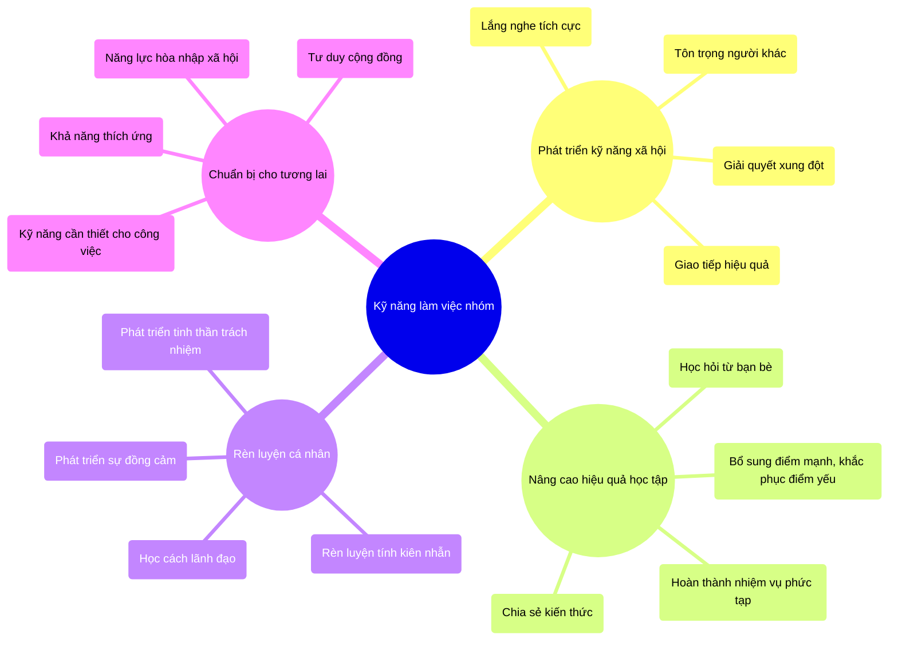
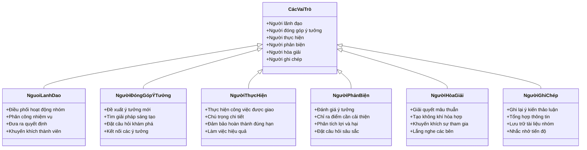
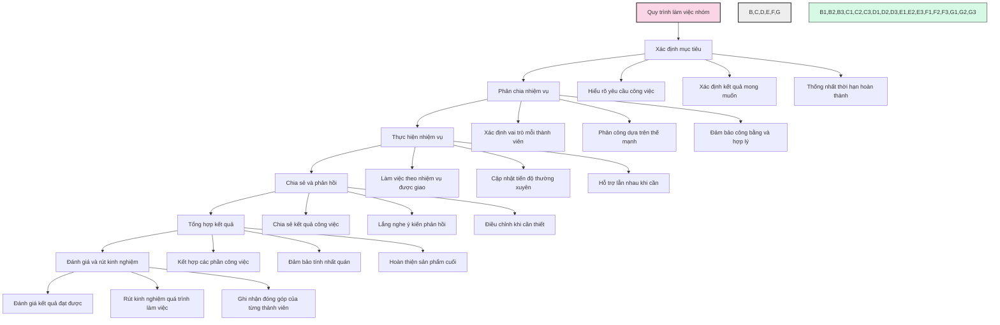
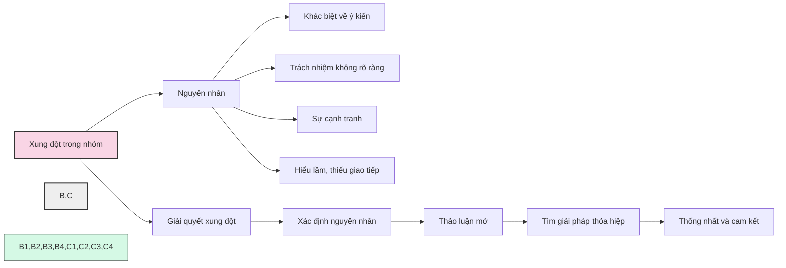
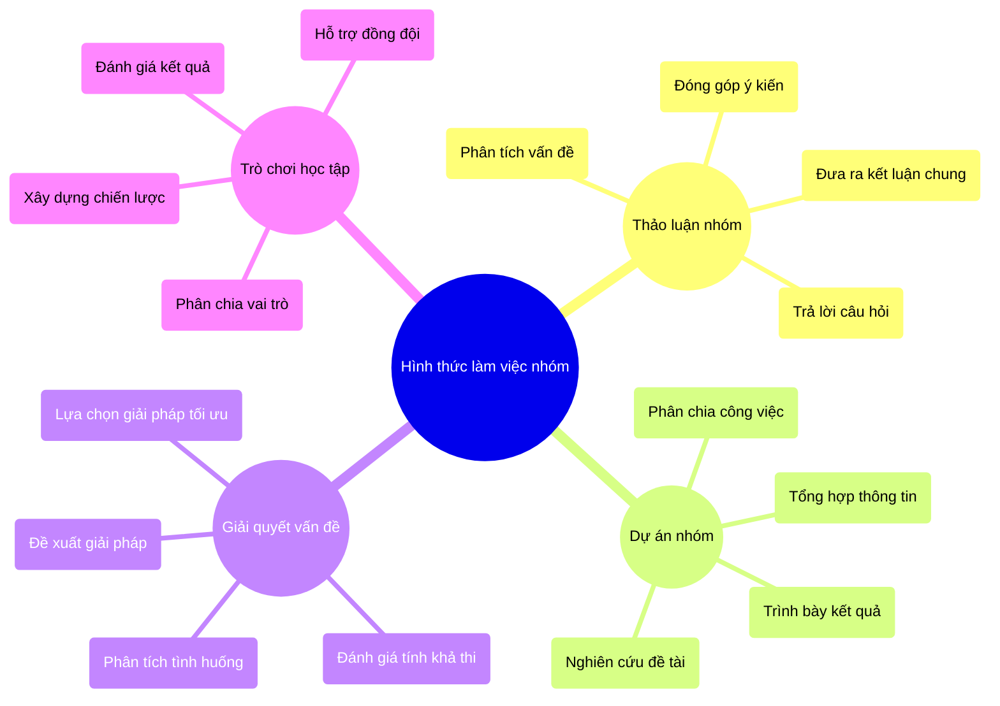
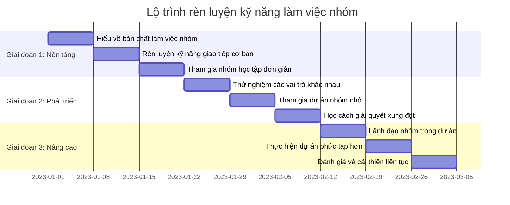
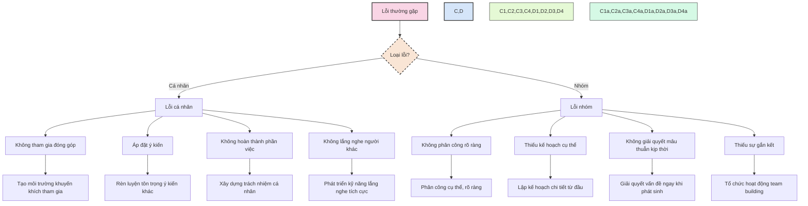
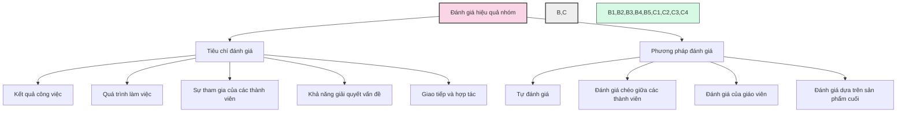

# Kỹ năng làm việc nhóm

Kỹ năng làm việc nhóm là khả năng hợp tác với người khác để đạt được mục tiêu chung. Đây là một trong những kỹ năng quan trọng không chỉ trong học tập mà còn trong cuộc sống, đặc biệt là trong các hoạt động của kỳ thi vào lớp 6 trường chuyên.

## 1. Tầm quan trọng của kỹ năng làm việc nhóm

## 2. Các vai trò trong nhóm

## 3. Quy trình làm việc nhóm hiệu quả

## 4. Kỹ năng giao tiếp trong nhóm

```mermaid
graph TD
    A[Kỹ năng giao tiếp trong nhóm] --> B[Lắng nghe tích cực]
    A --> C[Diễn đạt rõ ràng]
    A --> D[Đặt câu hỏi hiệu quả]
    A --> E[Phản hồi mang tính xây dựng]
    A --> F[Ngôn ngữ cơ thể]
    
    B --> B1[Tập trung vào người nói]
    B --> B2[Không ngắt lời]
    B --> B3[Ghi nhớ thông tin chính]
    
    C --> C1[Sử dụng từ ngữ đơn giản, rõ ràng]
    C --> C2[Sắp xếp ý tưởng theo trình tự logic]
    C --> C3[Kiểm tra sự hiểu biết của người nghe]
    
    D --> D1[Đặt câu hỏi mở]
    D --> D2[Đặt câu hỏi làm rõ]
    D --> D3[Đặt câu hỏi khuyến khích tư duy]
    
    E --> E1[Tập trung vào vấn đề, không phán xét cá nhân]
    E --> E2[Cân bằng giữa khen ngợi và góp ý]
    E --> E3[Đề xuất giải pháp cải thiện]
    
    F --> F1[Ánh mắt giao tiếp]
    F --> F2[Tư thế cởi mở]
    F --> F3[Biểu hiện sự quan tâm, tôn trọng]
    
    style A fill:#f9d5e5,stroke:#333,stroke-width:2px
    style B,C,D,E,F fill:#e5f9d5,stroke:#333,stroke-width:2px
    style B1,B2,B3,C1,C2,C3,D1,D2,D3,E1,E2,E3,F1,F2,F3 fill:#d5e5f9,stroke:#333,stroke-width:1px
```

## 5. Giải quyết xung đột trong nhóm

## 6. Các hình thức làm việc nhóm trong kỳ thi

## 7. Phương pháp rèn luyện kỹ năng làm việc nhóm

```mermaid
flowchart TD
    A[Rèn luyện kỹ năng làm việc nhóm] --> B[Tham gia các hoạt động nhóm]
    A --> C[Rèn luyện kỹ năng giao tiếp]
    A --> D[Thực hành các vai trò khác nhau]
    A --> E[Học cách giải quyết mâu thuẫn]
    A --> F[Phản ánh và tự đánh giá]
    
    B --> B1[Tham gia câu lạc bộ học tập]
    B --> B2[Làm bài tập nhóm]
    B --> B3[Tham gia trò chơi đồng đội]
    
    C --> C1[Luyện tập trình bày ý kiến]
    C --> C2[Rèn kỹ năng lắng nghe]
    C --> C3[Tập phản hồi tích cực]
    
    D --> D1[Thử vai trò lãnh đạo]
    D --> D2[Làm người ghi chép]
    D --> D3[Đóng góp ý tưởng sáng tạo]
    
    E --> E1[Học kỹ năng thương lượng]
    E --> E2[Tập nhìn nhận đa chiều]
    E --> E3[Đặt mục tiêu chung lên trên]
    
    F --> F1[Đánh giá sau mỗi hoạt động nhóm]
    F --> F2[Nhận xét từ bạn bè, giáo viên]
    F --> F3[Xác định điểm cần cải thiện]
    
    style A fill:#f9d5e5,stroke:#333,stroke-width:2px
    style B,C,D,E,F fill:#eeeeee,stroke:#333,stroke-width:2px
    style B1,B2,B3,C1,C2,C3,D1,D2,D3,E1,E2,E3,F1,F2,F3 fill:#d5f9e5,stroke:#333,stroke-width:1px
```

## 8. Lộ trình rèn luyện kỹ năng làm việc nhóm

## 9. Những lỗi thường gặp khi làm việc nhóm

## 10. Đánh giá hiệu quả làm việc nhóm

---

Kỹ năng làm việc nhóm là một trong những năng lực quan trọng cần được phát triển từ sớm. Không chỉ giúp học sinh thực hiện tốt các hoạt động trong kỳ thi, kỹ năng này còn là nền tảng cho sự thành công trong học tập và cuộc sống tương lai. Việc rèn luyện thường xuyên, chủ động tham gia các hoạt động nhóm, và cởi mở học hỏi từ người khác sẽ giúp học sinh phát triển toàn diện kỹ năng làm việc nhóm. 