# Giới thiệu StepUp6

Chào mừng bạn đến với **StepUp6** - Bộ tài liệu luyện thi toàn diện dành cho học sinh lớp 5 chuẩn bị thi vào THCS chuyên.

## Mục tiêu của StepUp6

StepUp6 được xây dựng với các mục tiêu chính:

- **Hỗ trợ tự học hiệu quả**: Giúp học sinh lớp 5 tự ôn tập kiến thức và rèn luyện kỹ năng
- **Công cụ đồng hành cho phụ huynh**: Cung cấp tài liệu tin cậy để hướng dẫn con em ôn tập
- **Hệ thống hóa kiến thức toàn diện**: Tổng hợp kiến thức và kỹ năng theo cấu trúc logic, khoa học
- **Phương pháp tiếp cận đa chiều**: Ôn tập cả kiến thức và phát triển kỹ năng thực hành

## Điểm nổi bật

### Tổng hợp tài liệu uy tín

Chúng tôi đã thu thập và chọn lọc:
- **Đề thi và tài liệu luyện thi** từ trường THCS Trần Đại Nghĩa (TP.HCM)
- **Đề thi và tài liệu luyện thi** từ trường THCS Trần Quốc Toản (TP.HCM)
- **Phương pháp học tập hiệu quả** từ các giáo viên có kinh nghiệm luyện thi

### Rèn luyện kỹ năng thực hành

- **Kỹ năng thuyết trình**: Phát triển khả năng trình bày rõ ràng, tự tin trước đám đông
- **Trình bày ý kiến**: Rèn luyện kỹ năng lập luận, sử dụng dẫn chứng thuyết phục
- **Làm việc nhóm**: Phát triển khả năng hợp tác, phân công và giải quyết vấn đề theo nhóm
- **Sáng tạo khẩu hiệu**: Trau dồi tư duy sáng tạo, ngôn ngữ súc tích và ấn tượng
- **Giải đố và tư duy sáng tạo**: Phát triển tư duy logic, suy luận và khả năng giải quyết vấn đề

### Phương pháp học tập khoa học

- **Học từ cơ bản đến nâng cao**: Xây dựng nền tảng kiến thức vững chắc trước khi tiếp cận vấn đề phức tạp
- **Lộ trình học tập có hệ thống**: Kế hoạch ôn tập theo tuần, tháng, phù hợp với thời gian chuẩn bị
- **Ôn luyện theo dạng bài**: Phân loại và luyện tập theo các dạng bài thường gặp trong đề thi
- **Phản hồi kịp thời**: Đáp án và hướng dẫn giải chi tiết giúp học sinh tự đánh giá và cải thiện

## Cấu trúc bộ tài liệu

StepUp6 được tổ chức thành các mảng kiến thức và kỹ năng chính như sau:

```mermaid
graph TD
    A[StepUp6] --> B[Đọc - Hiểu]
    A --> C[Toán học và Logic]
    A --> D[Kiến thức Khoa học - Xã hội]
    A --> E[Tiếng Anh]
    A --> F[Kỹ năng thực hành]
    A --> G[Đề thi và luyện tập]
    
    B --> B1[Đọc hiểu tiếng Việt]
    B --> B2[Đọc hiểu tiếng Anh]
    
    C --> C1[Toán ứng dụng]
    C --> C2[Logic và IQ]
    
    D --> D1[Khoa học và Môi trường]
    D --> D2[Địa lý, Lịch sử và Văn hóa]
    
    E --> E1[Nghe]
    E --> E2[Đọc]
    E --> E3[Viết]
    E --> E4[Từ vựng và Ngữ pháp]
    
    F --> F1[Thuyết trình]
    F --> F2[Trình bày ý kiến]
    F --> F3[Làm việc nhóm]
    F --> F4[Sáng tạo khẩu hiệu]
    F --> F5[Giải đố và tư duy sáng tạo]
    
    G --> G1[Đề thi theo trường]
    G --> G2[Bài tập theo chuyên đề]
    G --> G3[Đề thi thử]
```

## Cách sử dụng bộ tài liệu

1. **Đánh giá năng lực hiện tại**: Làm bài kiểm tra đầu vào để xác định điểm mạnh, điểm yếu
2. **Chọn lộ trình phù hợp**: Dựa trên thời gian chuẩn bị (1, 3 hoặc 6 tháng)
3. **Ôn tập theo chuyên đề**: Học lý thuyết và làm bài tập theo từng chuyên đề
4. **Phát triển kỹ năng thực hành**: Rèn luyện các kỹ năng thực hành cần thiết cho kỳ thi
5. **Luyện đề và tự đánh giá**: Làm đề thi thử và theo dõi tiến độ học tập
6. **Điều chỉnh lộ trình**: Cải thiện những phần còn yếu, tập trung vào kiến thức trọng tâm

## Lời khuyên cho học sinh

- **Học đều đặn mỗi ngày**: Dành thời gian học tập cố định để hình thành thói quen
- **Đặt mục tiêu cụ thể**: Xác định mục tiêu cho từng ngày, tuần và tháng
- **Vừa học vừa thực hành**: Kết hợp học lý thuyết với luyện tập kỹ năng thực hành
- **Không ngại khó**: Đối mặt với những dạng bài khó và tìm cách giải quyết
- **Nghỉ ngơi hợp lý**: Đảm bảo thời gian nghỉ ngơi để duy trì hiệu suất học tập

Hãy bắt đầu hành trình chinh phục kỳ thi vào trường THCS chuyên cùng StepUp6!
